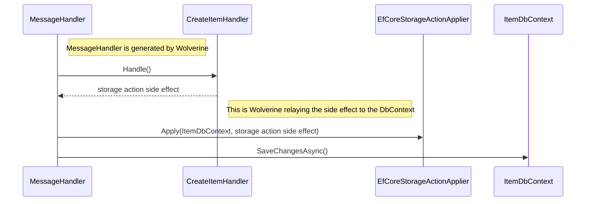

# Isolating Side Effects from Handlers

::: tip
For easier unit testing, it's often valuable to separate responsibilities of "deciding" what to do from the actual "doing." The side
effect facility in Wolverine is an example of this strategy.
:::

::: info
Unlike [cascading messages](/guide/handlers/cascading), "side effects" are processed inline with the originating message and within the same logical
transaction.
:::

At times, you may with to make Wolverine message handlers (or HTTP endpoints) be [pure functions](https://en.wikipedia.org/wiki/Pure_function)
as a way of making the handler code itself easier to test or even just to understand. All the same, your application
will almost certainly be interacting with the outside world of databases, file systems, and external infrastructure of all types.
Not to worry though, Wolverine has some facility to allow you to declare the *[side effects](https://en.wikipedia.org/wiki/Side_effect_(computer_science))*
as return values from your handler. 

To make this concrete, let's say that we're building a message handler that will take in some textual content and an id, and then
try to write that text to a file at a certain path. In our case, we want to be able to easily unit test the logic that "decides" what
content and what file path a message should be written to without ever having any usage of the actual file system (which is notoriously
irritating to use in tests).

First off, I'm going to create a new "side effect" type for writing a file like this:

<!-- snippet: sample_WriteFile -->
<a id='snippet-sample_writefile'></a>
```cs
// This has to be public btw
public record WriteFile(string Path, string Contents)
{
    public Task WriteAsync()
    {
        return File.WriteAllTextAsync(Path, Contents);
    }
}
```
<sup><a href='https://github.com/JasperFx/wolverine/blob/main/src/Samples/DocumentationSamples/CustomReturnType.cs#L12-L23' title='Snippet source file'>snippet source</a> | <a href='#snippet-sample_writefile' title='Start of snippet'>anchor</a></sup>
<a id='snippet-sample_writefile-1'></a>
```cs
// ISideEffect is a Wolverine marker interface
public class WriteFile : ISideEffect
{
    public string Path { get; }
    public string Contents { get; }

    public WriteFile(string path, string contents)
    {
        Path = path;
        Contents = contents;
    }

    // Wolverine will call this method.
    public Task ExecuteAsync(PathSettings settings)
    {
        if (!Directory.Exists(settings.Directory))
        {
            Directory.CreateDirectory(settings.Directory);
        }

        return File.WriteAllTextAsync(Path, Contents);
    }
}
```
<sup><a href='https://github.com/JasperFx/wolverine/blob/main/src/Testing/CoreTests/Acceptance/using_custom_side_effect.cs#L41-L67' title='Snippet source file'>snippet source</a> | <a href='#snippet-sample_writefile-1' title='Start of snippet'>anchor</a></sup>
<!-- endSnippet -->

And the matching message type, message handler, and a settings class for configuration:

<!-- snippet: sample_RecordTextHandler -->
<a id='snippet-sample_recordtexthandler'></a>
```cs
// An options class
public class PathSettings
{
    public string Directory { get; set; }
        = Environment.CurrentDirectory.AppendPath("files");
}

public record RecordText(Guid Id, string Text);

public class RecordTextHandler
{
    public WriteFile Handle(RecordText command)
    {
        return new WriteFile(command.Id + ".txt", command.Text);
    }
}
```
<sup><a href='https://github.com/JasperFx/wolverine/blob/main/src/Testing/CoreTests/Acceptance/using_custom_side_effect.cs#L20-L39' title='Snippet source file'>snippet source</a> | <a href='#snippet-sample_recordtexthandler' title='Start of snippet'>anchor</a></sup>
<!-- endSnippet -->

At runtime, Wolverine is generating this code to handle the `RecordText` message:

```csharp
    public class RecordTextHandler597515455 : Wolverine.Runtime.Handlers.MessageHandler
    {
        public override System.Threading.Tasks.Task HandleAsync(Wolverine.Runtime.MessageContext context, System.Threading.CancellationToken cancellation)
        {
            var recordTextHandler = new CoreTests.Acceptance.RecordTextHandler();
            var recordText = (CoreTests.Acceptance.RecordText)context.Envelope.Message;
            var pathSettings = new CoreTests.Acceptance.PathSettings();
            var outgoing1 = recordTextHandler.Handle(recordText);
            
            // Placed by Wolverine's ISideEffect policy
            return outgoing1.ExecuteAsync(pathSettings);
        }
    }
```

To explain what is happening up above, when Wolverine sees that any return value from a message
handler implements the `Wolverine.ISideEffect` interface, Wolverine knows that that value
should have a method named either `Execute` or `ExecuteAsync()` that should be executed
instead of treating the return value as a cascaded message. The method discovery is completely
by method name, and it's perfectly legal to use arguments for any of the same types
available to the actual message handler like:

* Service dependencies from the application's IoC container
* The actual message
* Any objects created by middleware
* `CancellationToken`
* Message metadata from `Envelope`

You can find more usages of side effect return values in the [Marten side effect operations](/guide/durability/marten/operations).

## Storage Side Effects <Badge type="tip" text="3.6" />

::: info
Wolverine may not be a functional programming toolset per se, but it's at least "FP-adjacent." The storage
side effects explained in this section are arguably side effect monads from functional programming where the goal
is to keep the behavioral logic function "pure" so that it can be easily tested and reasoned about without
any of the actual persistence infrastructure being involved. The actual "side effect" object will be part
of invoking the actual persistence tooling to make writes to the underlying database.
:::

It's more than likely that your application using Wolverine will be using some kind of persistence
tooling that you use to load and persist entity objects. Wolverine has first class support for designating
entity values for persistence as part of its philosophy of utilizing [pure functions](https://en.wikipedia.org/wiki/Pure_function) for the behavioral
part of message handlers or HTTP endpoint methods -- *and this is advantageous because it allows
you to write behavioral code in your message handlers or HTTP endpoints that is easy to unit test
and reason about without having to employ high ceremony layering approaches.

::: info
Returning any kind of `IStorageAction<T>` type or the `UnitOfWork<T>` type from a handler method or HTTP endpoint
method will automatically apply transactional middleware around that handler or endpoint regardless of whether auto
transactions are configured.
:::

As a quick, concrete example, let's say that you have a message handler that conditionally creates a new `Item` if
the request doesn't contain any profanity (it's late and I'm struggling to come up with sample use cases). With
the storage side effect approach, you could code that like this:

<!-- snippet: sample_using_conditional_storage_action -->
<a id='snippet-sample_using_conditional_storage_action'></a>
```cs
public record CreateItem(Guid Id, string Name);

public static class CreateItemHandler
{
    // It's always a struggle coming up with sample use cases
    public static IStorageAction<Item> Handle(
        CreateItem command, 
        IProfanityDetector detector)
    {
        // First see if the name is valid
        if (detector.HasProfanity(command.Name))
        {
            // and if not, do nothing
            return Storage.Nothing<Item>();
        }

        return Storage.Insert(new Item
        {
            Id = command.Id, 
            Name = command.Name
        });
    }
}
```
<sup><a href='https://github.com/JasperFx/wolverine/blob/main/src/Testing/CoreTests/Persistence/StorageSamples.cs#L21-L47' title='Snippet source file'>snippet source</a> | <a href='#snippet-sample_using_conditional_storage_action' title='Start of snippet'>anchor</a></sup>
<!-- endSnippet -->

In the handler above, if we return `Wolverine.Persistence.IStorageAction<Item>`, that's recognized by Wolverine as a
side effect that means an action should be taken to persist or delete an entity by the underlying persistence mechanism. 
Assuming that your application is using an EF Core service named `ItemDbContext` to persist
the `Item` entities, the storage action side effect workflow at runtime is something like this:



Wolverine itself is generating the necessary code to take the side effect object you returned and
apply that to the right persistence tool for the wrapped entity. In all cases, if you're ever
curious or having any trouble understanding what Wolverine is doing with your side effect return
types, look at the [pre-generated message handler code](/guide/codegen). 

As
a convenience, you can create these side effect return values by using the static factory methods on the `Wolverine.Persistence.Storage` class,
or just directly build a return value like:

```csharp
return new Insert<Item>(new Item{});
```

This storage side effect model can support these operations:

1. `Insert` -- some persistence tools will use their "upsert" functionality here
2. `Update`
3. `Store` -- which means "upsert" for the persistence tools like Marten or RavenDb that natively support upserts. For EF Core, this is an `Update`
4. `Delete` -- delete that entity
5. `Nothing` -- do absolutely nothing, but at least you don't have to return a null

In your method signatures, you can:

* Return `IStorageAction<T>` which allows your handler or HTTP endpoint method to have some logic about whether the wrapped entity should be inserted, updated, deleted, or do absolutely nothing depending on business rules
* Return a specific `Delete<T>` or `Insert<T>` or other storage action types
* Use any of these types in a tuple return value just like any other type of side effect value
* Return null values, in which case Wolverine is smart enough to do nothing

::: info
As of now, this usage is supported by Wolverine's [Marten](/guide/durability/marten/), [EF Core](/guide/durability/efcore), and [RavenDb](/guide/durability/ravendb) integrations.
Do note that not every persistence integration supports the `Store()` ["upsert"](https://en.wiktionary.org/wiki/upsert) capability (EF Core does not). 
:::

If you want to return a variable number of storage actions from a message handler, you'll want 
to use the `Wolverine.Persistence.UnitOfWork<T>` type as a return type as shown below:

<!-- snippet: sample_using_unit_of_work_as_side_effect -->
<a id='snippet-sample_using_unit_of_work_as_side_effect'></a>
```cs
public record StoreMany(string[] Adds);

public static class StoreManyHandler
{
    public static UnitOfWork<Todo> Handle(StoreMany command)
    {
        var uow = new UnitOfWork<Todo>();
        foreach (var add in command.Adds)
        {
            uow.Insert(new Todo { Id = add });
        }

        return uow;
    }
}
```
<sup><a href='https://github.com/JasperFx/wolverine/blob/main/src/Testing/Wolverine.ComplianceTests/StorageActionCompliance.cs#L427-L445' title='Snippet source file'>snippet source</a> | <a href='#snippet-sample_using_unit_of_work_as_side_effect' title='Start of snippet'>anchor</a></sup>
<!-- endSnippet -->

The `UnitOfWork<T>` is really just a `List<IStorageAction<T>>` that can relay zero to many storage
actions to your underlying persistence tooling. 
