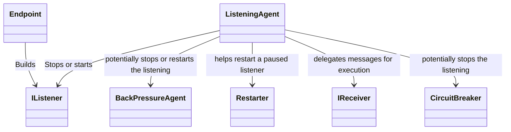

# Listening Endpoints

::: tip
Unlike some other .NET messaging frameworks, Wolverine does not require specific message handlers to be registered
at a certain listening endpoint like a Rabbit MQ queue or Kafka topic.
:::

A vital piece of Wolverine is defining or configuring endpoints where Wolverine "listens" for incoming messages to 
pass to the Wolverine message handlers. 

Examples of endpoints supported by Wolverine that can listen for messages include:

* TCP endpoints with Wolverine's built in socket based transport
* Rabbit MQ queues
* Azure Service Bus subscriptions or queues
* Kafka topics
* Pulsar topics
* AWS SQS queues

Listening endpoints with Wolverine come in three flavors as shown below:

<!-- snippet: sample_configuring_listener_types -->
<a id='snippet-sample_configuring_listener_types'></a>
```cs
using var host = await Host.CreateDefaultBuilder()
    .UseWolverine(opts =>
    {
        // The Rabbit MQ transport supports all three types of listeners
        opts.UseRabbitMq();

        // The durable mode requires some sort of envelope storage
        opts.PersistMessagesWithPostgresql("some connection string");

        opts.ListenToRabbitQueue("inline")
            // Process inline, default is with one listener
            .ProcessInline()

            // But, you can use multiple, parallel listeners
            .ListenerCount(5);

        opts.ListenToRabbitQueue("buffered")
            // Buffer the messages in memory for increased throughput
            .BufferedInMemory(new BufferingLimits(1000, 500));

        opts.ListenToRabbitQueue("durable")
            // Opt into durable inbox mechanics
            .UseDurableInbox(new BufferingLimits(1000, 500));

    }).StartAsync();
```
<sup><a href='https://github.com/JasperFx/wolverine/blob/main/src/Samples/DocumentationSamples/ListenerTypes.cs#L13-L41' title='Snippet source file'>snippet source</a> | <a href='#snippet-sample_configuring_listener_types' title='Start of snippet'>anchor</a></sup>
<!-- endSnippet -->

## Inline Endpoints

With `Inline` endpoints, the basic processing of messages is:

1. A message is received by the listener
2. The listener passes the message directly to Wolverine for handling
3. Depending on whether the message execution succeeds or fails, the message is either "ack-ed" or "nack-ed"
   to the underlying transport broker

Use the `Inline` mode if you care about message ordering or if you do not want guaranteed delivery
without having to use any kind of message persistence.

To improve throughput, you can direct Wolverine to use a number of parallel listeners, but the default is
just 1 per listening endpoint.

## Buffered Endpoints

::: tip
Use `Buffered` endpoints where throughput is more important than delivery guarantees
:::

With `Buffered` endpoints, the basic processing of messages is:

1. A message -- or batch of messages for transports like AWS SQS or Azure Service Bus that support batching --
   arrives from the listener and is immediately "ack-ed" to the message broker
2. The message is placed into an in memory queue where it will be handled

With `Buffered` endpoints, you can:

* Specify the maximum number of parallel messages that can be handled at once
* Specify buffering limits on the maximum number of messages that can be held in memory to enforce back pressure rules
  that will stop and restart message listening when the number of in memory messages goes down to an 
  acceptable level

Requeue error actions just put the failed message back into the in memory queue at the back of the queue.

## Durable Endpoints

`Durable` endpoints essentially work the same as `Buffered` endpoints, but utilize Wolverine's [transactional
inbox support](/guide/durability) for guaranteed delivery and processing.

With `Durable` endpoints, the basic processing of messages is:

1. A message -- or batch of messages for transports like AWS SQS or Azure Service Bus that support batching --
   arrives from the listener and is immediately "ack-ed" to the message broker
2. Each message -- or message batch -- is persisted to Wolverine's message storage
3. The message is placed into an in memory queue where it will be handled one at a time
4. When a message is successfully handled or moved to a dead letter queue, the message in the database
   is marked as "Handled"

The durable inbox keeps handled messages in the database for just a little while (5 minutes is the default)
to use for some built in idempotency on message id for incoming messages.

## Internal Architecture

If you're curious, here's a diagram of the types involved in listening to messages from 
a single `Endpoint`. Just know that `Endpoint` only models the configuration of the listener in
most transport types:



* `Endpoint` is a configuration element that models how the listener should behave
* `IListener` is a specific service built by the `Endpoint` that does the actual work of listening to messages incoming
  from the messaging transport like a Rabbit MQ broker, and passes that information to Wolverine's message handlers
* `ListeningAgent` is a controller within Wolverine that governs the listener lifecycle including pauses and restarts depending
  on load or error conditions

## Strictly Ordered Listeners <Badge type="tip" text="2.3" />

In the case where you need messages from a single endpoint to be processed in strict, global order across the entire application,
you have the `ListenWithStrictOrdering()` option:

<!-- snippet: sample_utilizing_ListenWithStrictOrdering -->
<a id='snippet-sample_utilizing_ListenWithStrictOrdering'></a>
```cs
var host = await Host.CreateDefaultBuilder().UseWolverine(opts =>
{
    opts.UseRabbitMq().EnableWolverineControlQueues();
    opts.PersistMessagesWithPostgresql(Servers.PostgresConnectionString, "listeners");

    opts.ListenToRabbitQueue("ordered")

        // This option is available on all types of Wolverine
        // endpoints that can be configured to be a listener
        .ListenWithStrictOrdering();
}).StartAsync();
```
<sup><a href='https://github.com/JasperFx/wolverine/blob/main/src/Transports/RabbitMQ/Wolverine.RabbitMQ.Tests/exclusive_listeners.cs#L34-L48' title='Snippet source file'>snippet source</a> | <a href='#snippet-sample_utilizing_ListenWithStrictOrdering' title='Start of snippet'>anchor</a></sup>
<!-- endSnippet -->

This option does a couple things:

* Ensures that Wolverine will *only* listen for messages on this endpoint on a single running node
* Sets any local execution of the listener's internal, local queue to be strictly sequential and only process messages with
  a single thread


