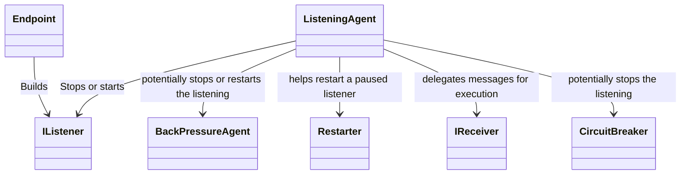

# Listening Endpoints

::: tip
Unlike some other .NET messaging frameworks, Wolverine does not require specific message handlers to be registered
at a certain listening endpoint like a Rabbit MQ queue or Kafka topic.
:::

A vital piece of Wolverine is defining or configuring endpoints where Wolverine "listens" for incoming messages to 
pass to the Wolverine message handlers. 

Examples of endpoints supported by Wolverine that can listen for messages include:

* TCP endpoints with Wolverine's built in socket based transport
* Rabbit MQ queues
* Azure Service Bus subscriptions or queues
* Kafka topics
* Pulsar topics
* AWS SQS queues

Listening endpoints with Wolverine come in three flavors as shown below:

<!-- snippet: sample_configuring_listener_types -->
<a id='snippet-sample_configuring_listener_types'></a>
```cs
using var host = await Host.CreateDefaultBuilder()
    .UseWolverine(opts =>
    {
        // The Rabbit MQ transport supports all three types of listeners
        opts.UseRabbitMq();

        // The durable mode requires some sort of envelope storage
        opts.PersistMessagesWithPostgresql("some connection string");

        opts.ListenToRabbitQueue("inline")
            // Process inline, default is with one listener
            .ProcessInline()

            // But, you can use multiple, parallel listeners
            .ListenerCount(5);

        opts.ListenToRabbitQueue("buffered")
            // Buffer the messages in memory for increased throughput
            .BufferedInMemory(new BufferingLimits(1000, 500));

        opts.ListenToRabbitQueue("durable")
            // Opt into durable inbox mechanics
            .UseDurableInbox(new BufferingLimits(1000, 500));

    }).StartAsync();
```
<sup><a href='https://github.com/JasperFx/wolverine/blob/main/src/Samples/DocumentationSamples/ListenerTypes.cs#L13-L40' title='Snippet source file'>snippet source</a> | <a href='#snippet-sample_configuring_listener_types' title='Start of snippet'>anchor</a></sup>
<!-- endSnippet -->

## Inline Endpoints

With `Inline` endpoints, the basic processing of messages is:

1. A message is received by the listener
2. The listener passes the message directly to Wolverine for handling
3. Depending on whether the message execution succeeds or fails, the message is either "ack-ed" or "nack-ed"
   to the underlying transport broker

Use the `Inline` mode if you care about message ordering or if you do not want guaranteed delivery
without having to use any kind of message persistence.

To improve throughput, you can direct Wolverine to use a number of parallel listeners, but the default is
just 1 per listening endpoint. Note that `ListenerCount()` — and *not* `MaximumParallelMessages()` — is the
throughput knob for an `Inline` endpoint, because an `Inline` endpoint has no local execution block for
`MaximumParallelMessages()` to size. See [Which settings apply in which mode](#which-settings-apply-in-which-mode)
below.

### Processing Inline While Draining

By default, when Wolverine begins draining an inline listener during graceful shutdown, any messages still queued
in the receiver are immediately deferred back to the transport broker. If you'd prefer that already-ingested messages
continue processing to completion before the receiver shuts down, you can enable the `ProcessInlineWhileDraining` option:

```cs
opts.ListenToRabbitQueue("inline")
    .ProcessInline()

    // Allow messages already received by the listener to finish
    // processing during graceful shutdown instead of being deferred
    // back to the broker immediately.
    .ProcessInlineWhileDraining();
```

With this flag enabled:

* Messages that have already been received by the listener will continue to be processed through the handler pipeline
  while the drain is in progress.
* Once the drain completes, any new messages that arrive will be deferred as usual.

This is useful when deferring partially-processed batches could lead to latency outliers.

## Native Ack Endpoints <Badge type="tip" text="6.30" />

`NativeAck` fills the cell the other three modes leave empty: **Buffered's throughput and partitioning with
Inline's no-loss guarantee, and no database involvement.**

| | Broker ack timing | Loss window | Parallelism | Group partitioning | DB cost |
| --- | --- | --- | --- | --- | --- |
| `Inline` | after handler success | none | `ListenerCount` only | none | none |
| `NativeAck` | after handler success | none | `MaximumParallelMessages` | ✔️ | none |
| `BufferedInMemory` | at receipt, **before** the handler | crash loses buffered messages | `MaximumParallelMessages` | ✔️ | none |
| `Durable` | after the inbox insert | none | `MaximumParallelMessages` | ✔️ | inbox insert + mark-handled |

```csharp
opts.ListenToRabbitQueue("webhooks")
    .ProcessInParallelWithNativeAcks()
    .PartitionProcessingByGroupId(PartitionSlots.Five)
    .MaximumParallelMessages(10);
```

The delivery is held unacknowledged while the message flows through an in-memory, optionally
group-partitioned execution block, and is settled natively from the completion continuation — acked on
handler success, nacked or dead-lettered on terminal failure. Nothing is written to a database.

::: warning The guarantee, stated exactly
**Protection against intra-group concurrency is the hard guarantee. Strict sequential processing in original
delivery order is not.**

The sequential lane per group slot structurally guarantees that no two messages sharing a group id execute
concurrently on the owning node. Original-order processing is *not* guaranteed under failure, requeue, or
broker redelivery — a failed or redelivered message re-enters its lane later, never concurrently. That is the
honest contract for native-ack retry semantics on every broker. If you need strict order under failure, use
the durable inbox.
:::

Three consequences follow from never acking at receipt, and all three are the point rather than side effects:

* **Back pressure is the broker's prefetch window**, not `BufferingLimits`. The broker stops delivering once
  its unacked ceiling is reached, so no `BackPressureAgent` is created. On RabbitMQ the prefetch default
  covers every lane that can be busy at once — the partition slot count when group-partitioned, otherwise
  `MaximumParallelMessages` — doubled so a lane never starves.
* **A dying node loses nothing.** Anything queued but not yet completed is still unacknowledged, so closing
  the channel or crashing hands every one of those deliveries back to the broker.
* **Shutdown trades duplicates for safety.** Graceful drain processes what it can within the drain timeout;
  whatever it cannot is simply never settled and gets redelivered. A rolling deploy therefore produces
  duplicate deliveries bounded by the prefetch depth. Your handlers should already be idempotent under
  at-least-once delivery, but it is worth knowing the number is not zero. The
  [in-memory idempotency guard](#in-memory-idempotency-guard) below takes the edge off that for a *running*
  process.

**Transport support is opt-in and default-closed.** A transport must settle each delivery individually *and*
tolerate settling out of order, because the execution block completes messages in handler-completion order
rather than delivery order. RabbitMQ queues and [Pulsar](/guide/messaging/transports/pulsar.html#native-ack-processing)
topics qualify and are supported today. Kafka cannot and is out of scope: a cumulative offset commit has no
way to express a gap. Calling `ProcessInParallelWithNativeAcks()` on a transport that has not opted in throws
at configuration time rather than degrading silently.

A transport may also refuse the mode for a *particular* endpoint whose own settings contradict it, again at
bootstrap rather than at runtime. Pulsar is the example: its acknowledgment strategy is configurable, and
`AcknowledgeCumulative()` reintroduces exactly the gap-less-commit problem that disqualifies Kafka, so that
one combination is rejected by name.

## In-Memory Idempotency Guard <Badge type="tip" text="6.30" />

The [durable inbox](/guide/durability) deduplicates incoming messages on the primary key of its incoming
table: a redelivery of a message id it has already stored is acked back to the broker and never executed
again. `NativeAck`, `BufferedInMemory`, and `Inline` endpoints have no such table, and `NativeAck` in
particular is *at-least-once by design* — every rolling deploy leaves whatever the drain could not finish
unsettled, and the broker redelivers it.

`WithInMemoryIdempotency()` is the non-durable analogue: an opt-in, bounded, in-memory set of the message ids
this process has already handled on this endpoint. A redelivery of one is settled with the broker and dropped
without ever reaching your handler — the same outcome as the durable path, minus the database.

```csharp
opts.ListenToRabbitQueue("webhooks")
    .ProcessInParallelWithNativeAcks()
    .PartitionProcessingByGroupId(PartitionSlots.Five)

    // Opt in. Both arguments are optional; these are the defaults.
    .WithInMemoryIdempotency(window: 5.Minutes(), maxTracked: 100_000);
```

To turn it on everywhere rather than endpoint by endpoint, use a policy:

```csharp
opts.Policies.AllListeners(x => x.WithInMemoryIdempotency());
```

### What it does and does not promise

::: warning An in-memory guard does not survive a restart
The guard is **per process and in memory**. Three limits follow, and none of them is a bug:

* **A restart forgets everything.** The very deploy that produces the redelivery burst also empties the guard
  on the node that starts up. It protects a *running* process against a redelivery it saw itself.
* **A second node never knew.** With competing consumers, a redelivery can land on a different node than the
  original. With an exclusive listener (including the [partitioned topology](/guide/messaging/partitioning)
  story) redeliveries land on the node that owns the listener — the same node whose guard saw the original —
  so the guard is effective in steady state, but a failover hands the queue to a node starting from empty.
* **Eviction is generational, not exact.** An id is remembered for at least half the window and at most the
  whole window, and less than that when a flood of unique ids hits `maxTracked` first.

The promise is **at-least-once delivery with best-effort deduplication**, not exactly-once. If you need hard
deduplication that holds across restarts and across nodes, use the durable inbox. Handlers should still be
written to tolerate a duplicate.
:::

Note that duplicate *processing* under `NativeAck` is a cost and liveness concern rather than a correctness
one for group ordering: even a duplicate that slips past the guard runs in its group's sequential lane, so
the intra-group concurrency guarantee holds either way.

### Bounding and tuning

Memory is bounded by construction, which matters because the workload `NativeAck` exists for is exactly the
one that would make an unbounded set of seen ids a leak. Two hash sets — a current generation and the
previous one — are kept and both are consulted on lookup. The pair rotates on whichever comes first:

| Trigger | Effect |
| --- | --- |
| `window / 2` elapsed | current generation becomes previous, previous is dropped |
| `maxTracked / 2` ids in the current generation | same rotation, early — a flood of unique ids evicts by size rather than growing |

So the ceiling really is `maxTracked` ids, roughly single-digit megabytes at the 100,000 default, with no
per-entry timestamps and no LRU bookkeeping. Size the `window` to cover the redelivery burst you actually
expect — for `NativeAck` that is the drain timeout plus the broker's redelivery latency, seconds rather than
minutes — and leave `maxTracked` alone unless you are running a flood at a sustained rate where
`maxTracked / peak messages per second` would fall below that window.

### Where it applies

| Mode | Guard |
| --- | --- |
| `NativeAck` | ✔️ — the primary use case |
| `BufferedInMemory` | ✔️ |
| `Inline` | ✔️ |
| `Durable` | ignored (warns at startup) — the inbox already deduplicates, and does it better |
| Local queues | `NotSupportedException` — nothing redelivers to a local queue |

A message that fails and is handed *back* to the broker — nacked, requeued, or deferred during a drain — is
deliberately **not** remembered, because remembering it would suppress its own retry and turn a failure into
a lost message. Only a delivery that reached a terminal the broker will not undo (handler success, or a
native dead-letter move) is recorded. Duplicate drops are logged at `Debug`, not `Error`: in a mode that
never settles at receipt, redelivery is expected operational noise rather than a sign that something is wrong.

### Prefer broker-side deduplication where it exists

Some transports can deduplicate at the broker, which is strictly better than anything an in-process guard can
do — it survives restarts and spans nodes:

* **NATS JetStream** — a stream's `duplicate_window` deduplicates on the `Nats-Msg-Id` header.
* **SQS FIFO queues** — `MessageDeduplicationId`, with a five-minute window.
* **Google Cloud Pub/Sub** — subscription-level deduplication on a publisher-supplied `deduplication-id`.

Use those where they are available. This guard is chiefly for RabbitMQ classic and quorum queues, which have
nothing of the kind.

## Buffered Endpoints

::: tip
Use `Buffered` endpoints where throughput is more important than delivery guarantees
:::

With `Buffered` endpoints, the basic processing of messages is:

1. A message -- or batch of messages for transports like AWS SQS or Azure Service Bus that support batching --
   arrives from the listener and is immediately "ack-ed" to the message broker
2. The message is placed into an in memory queue where it will be handled

With `Buffered` endpoints, you can:

* Specify the maximum number of parallel messages that can be handled at once
* Specify buffering limits on the maximum number of messages that can be held in memory to enforce back pressure rules
  that will stop and restart message listening when the number of in memory messages goes down to an 
  acceptable level

Requeue error actions just put the failed message back into the in memory queue at the back of the queue.

Because the broker ack happens at receipt, a `Buffered` endpoint sees a redelivery only when the broker itself
resends one (a closed channel with the ack still in flight, say). The
[in-memory idempotency guard](#in-memory-idempotency-guard) is available here too if that matters to you.

## Durable Endpoints

`Durable` endpoints essentially work the same as `Buffered` endpoints, but utilize Wolverine's [transactional
inbox support](/guide/durability) for guaranteed delivery and processing.

With `Durable` endpoints, the basic processing of messages is:

1. A message -- or batch of messages for transports like AWS SQS or Azure Service Bus that support batching --
   arrives from the listener and is immediately "ack-ed" to the message broker
2. Each message -- or message batch -- is persisted to Wolverine's message storage
3. The message is placed into an in memory queue where it will be handled one at a time
4. When a message is successfully handled or moved to a dead letter queue, the message in the database
   is marked as "Handled"

The durable inbox keeps handled messages in the database for just a little while (5 minutes is the default)
to use for some built in idempotency on message id for incoming messages.

## Internal Architecture

If you're curious, here's a diagram of the types involved in listening to messages from 
a single `Endpoint`. Just know that `Endpoint` only models the configuration of the listener in
most transport types:


```mermaid
classDiagram

class Endpoint
class IListener
class ListeningAgent
class IReceiver

Endpoint-->IListener: Builds
ListeningAgent-->IListener: Stops or starts
ListeningAgent-->BackPressureAgent: potentially stops or restarts the listening
ListeningAgent-->Restarter: helps restart a paused listener
ListeningAgent-->IReceiver: delegates messages for execution
ListeningAgent-->CircuitBreaker: potentially stops the listening

```

* `Endpoint` is a configuration element that models how the listener should behave
* `IListener` is a specific service built by the `Endpoint` that does the actual work of listening to messages incoming
  from the messaging transport like a Rabbit MQ broker, and passes that information to Wolverine's message handlers
* `ListeningAgent` is a controller within Wolverine that governs the listener lifecycle including pauses and restarts depending
  on load or error conditions

## Maximum Parallel Messages

::: tip
Wolverine defaults the maximum number of parallel messages per endpoint to the greater of `Environment.ProcessorCount`
or 5. This ensures reasonable throughput even on low-core environments like containers or CI runners where `ProcessorCount`
may be as low as 1 or 2.
:::

You can override the default parallelism per endpoint:

```csharp
opts.ListenToRabbitQueue("high-throughput")
    .BufferedInMemory()
    .MaximumParallelMessages(20);
```

Or set a global default for all listening endpoints using a policy:

```csharp
opts.Policies.AllListeners(x => x.MaximumParallelMessages = 5);
```

## Which settings apply in which mode

Several listener settings only mean something for a mode that has a *local execution block* — the in-memory
queue that `BufferedInMemory` and `Durable` endpoints put between the transport listener and your handlers.
An `Inline` endpoint has no such block: it executes each message directly on the transport's listening
callback. Settings that size or shard that block therefore do nothing on an `Inline` endpoint.

| Setting | `Inline` | `NativeAck` | `BufferedInMemory` | `Durable` |
| --- | --- | --- | --- | --- |
| `MaximumParallelMessages(n)` / `Sequential()` | ignored (warns) | ✔️ | ✔️ | ✔️ |
| `PartitionProcessingByGroupId(slots)` | **throws at startup** | ✔️ | ✔️ | ✔️ |
| `BufferedInMemory(limits)` / `UseDurableInbox(limits)` back pressure | ignored (warns) | n/a — broker prefetch | ✔️ | ✔️ |
| `ListenerCount(n)` | ✔️ | ✔️ | ✔️ | ✔️ |
| `ListenWithStrictOrdering()` / `ListenOnlyAtLeader()` | ✔️ (exclusivity only) | ✔️ | ✔️ | ✔️ |
| `ExclusiveNodeWithParallelism(n)` | ✔️ exclusivity, parallelism ignored (warns) | ✔️ | ✔️ | ✔️ |
| `CircuitBreaker()` | ✔️ | ✔️ | ✔️ | ✔️ |
| [`WithInMemoryIdempotency()`](#in-memory-idempotency-guard) | ✔️ | ✔️ | ✔️ | ignored (warns) |

As of Wolverine 6.30, these combinations are no longer silently accepted:

* `ProcessInline()` together with `PartitionProcessingByGroupId()` throws an
  `InvalidListenerConfigurationException` at bootstrap. Partitioned processing is a *guarantee* — messages
  sharing a group id never run concurrently — and an `Inline` endpoint cannot make it, so failing to start
  is preferable to quietly not honoring it.
* `ProcessInline()` together with an explicit parallelism or `BufferingLimits` logs a warning at startup, and
  Wolverine normalizes `MaxDegreeOfParallelism` to 1.
* `ProcessInline()` on a [local queue](/guide/messaging/transports/local) throws a `NotSupportedException`
  right where you call it, because a local queue has no transport listener to be inline with — the queue
  itself *is* the local execution block. A local queue that reaches `Inline` through one of the lazily
  resolved configuration points (`LocalQueueFor<T>()`, `IConfigureLocalQueue`) throws an
  `InvalidListenerConfigurationException` at bootstrap instead.

That normalization also removes an order dependency: `.MaximumParallelMessages(20).ProcessInline()` and
`.ProcessInline().MaximumParallelMessages(20)` now leave the endpoint in exactly the same state. The
`wolverine describe` and `wolverine diagnose` listener tables likewise print `n/a (Inline)` for parallelism
rather than a number the endpoint never reads.

How many messages an `Inline` listener actually handles at once is up to the transport's own listener — for
example RabbitMQ's `ConsumerDispatchConcurrency` — plus `ListenerCount()`.

::: warning
This most often bites with a [partitioned messaging topology](/guide/messaging/partitioning) on RabbitMQ,
because RabbitMQ queues are `Inline` by default. A topology built with `PublishToShardedRabbitQueues()` sets
the group id slots on its listeners, so unless you also opt those listeners into a mode that can honor them
Wolverine will now refuse to start:

```csharp
opts.MessagePartitioning.PublishToShardedRabbitQueues("letters", 4, topology =>
{
    topology.MessagesImplementing<ILetterMessage>();
    topology.MaxDegreeOfParallelism = PartitionSlots.Five;

    // Required -- RabbitMQ queues are Inline by default, and an Inline
    // listener cannot honor the group id ordering guarantee
    topology.ConfigureListening(x => x.BufferedInMemory());
});
```

Before this check that configuration started cleanly and simply did not partition anything.
:::

## Strictly Ordered Listeners <Badge type="tip" text="2.3" />

In the case where you need messages from a single endpoint to be processed in strict, global order across the entire application,
you have the `ListenWithStrictOrdering()` option:

<!-- snippet: sample_utilizing_listenwithstrictordering -->
<a id='snippet-sample_utilizing_listenwithstrictordering'></a>
```cs
var host = await Host.CreateDefaultBuilder().UseWolverine(opts =>
{
    opts.UseRabbitMq().EnableWolverineControlQueues();
    opts.PersistMessagesWithPostgresql(Servers.PostgresConnectionString, "listeners");

    opts.ListenToRabbitQueue("ordered")

        // This option is available on all types of Wolverine
        // endpoints that can be configured to be a listener
        .ListenWithStrictOrdering();
}).StartAsync();
```
<sup><a href='https://github.com/JasperFx/wolverine/blob/main/src/Transports/RabbitMQ/Wolverine.RabbitMQ.Tests/exclusive_listeners.cs#L34-L47' title='Snippet source file'>snippet source</a> | <a href='#snippet-sample_utilizing_listenwithstrictordering' title='Start of snippet'>anchor</a></sup>
<!-- endSnippet -->

This option does a couple things:

* Ensures that Wolverine will *only* listen for messages on this endpoint on a single running node
* Sets any local execution of the listener's internal, local queue to be strictly sequential and only process messages with
  a single thread

If the endpoint is also using the durable inbox, the node that currently holds the listener is the *only* node
that recovers that endpoint's dormant inbox messages — the per-database durability agents deliberately leave
them alone. See [Inbox Recovery Ownership](/guide/messaging/exclusive-node-processing#inbox-recovery-ownership)
for the details. The same applies to `ListenOnlyAtLeader()`.

## Disabling All External Listeners

In some cases, you may want to disable all message processing for messages received from external
transports like Rabbit MQ or AWS SQS. To do that, simply set:

<!-- snippet: sample_disable_all_listeners -->
<a id='snippet-sample_disable_all_listeners'></a>
```cs
.UseWolverine(opts =>
{
    // This will disable all message listening to
    // external message brokers
    opts.DisableAllExternalListeners = true;
    
    opts.DisableConventionalDiscovery();

    // This could never, ever work
    opts.UseRabbitMq().AutoProvision();
    opts.ListenToRabbitQueue("incoming");
}).StartAsync();
```
<sup><a href='https://github.com/JasperFx/wolverine/blob/main/src/Transports/RabbitMQ/Wolverine.RabbitMQ.Tests/disable_external_listeners.cs#L16-L30' title='Snippet source file'>snippet source</a> | <a href='#snippet-sample_disable_all_listeners' title='Start of snippet'>anchor</a></sup>
<!-- endSnippet -->

The original use case for this flag was a command line tool that needed to publish messages to
a system through Rabbit MQ then exit. Having that process also trying to publish messages received
from Rabbit MQ kept the command line tool from quitting quickly as Wolverine had to "drain" ongoing
work. For that kind of tool, we recommend this setting.

