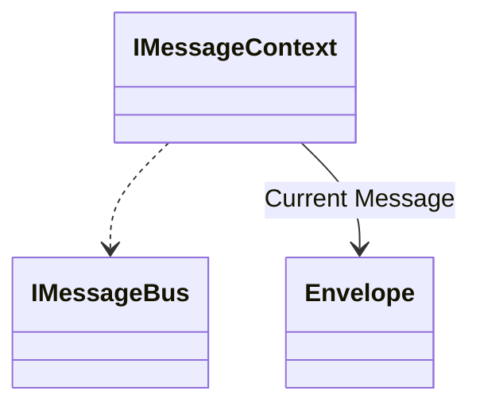

# Sending Messages with IMessageBus

The main entry point into Wolverine to initiate any message handling or publishing is the `IMessageBus` service
that is registered by Wolverine into your application's IoC container as a scoped service. Here's a brief sample
of the most common operations you'll use with `IMessageBus` and Wolverine itself:

There's also a second abstraction called `IMessageContext` that can be optionally consumed
within message handlers to add some extra operations and metadata for the
current message being processed in a handler:



Here's a quick sample usage of the most common operations you'll use with Wolverine:

<!-- snippet: sample_message_bus_basics -->
<a id='snippet-sample_message_bus_basics'></a>
```cs
public static async Task use_message_bus(IMessageBus bus)
{
    // Execute this command message right now! And wait until
    // it's completed or acknowledged
    await bus.InvokeAsync(new DebitAccount(1111, 100));

    // Execute this message right now, but wait for the declared response
    var status = await bus.InvokeAsync<AccountStatus>(new DebitAccount(1111, 250));

    // Send the message expecting there to be at least one subscriber to be executed later, but
    // don't wait around
    await bus.SendAsync(new DebitAccount(1111, 250));

    // Or instead, publish it to any interested subscribers, 
    // but don't worry about it if there are actually any subscribers
    // This is probably best for raising event messages
    await bus.PublishAsync(new DebitAccount(1111, 300));

    // Send a message to be sent or executed at a specific time
    await bus.ScheduleAsync(new DebitAccount(1111, 100), DateTimeOffset.UtcNow.AddDays(1));

    // Or do the same, but this time express the time as a delay
    await bus.ScheduleAsync(new DebitAccount(1111, 225), 1.Days());
}
```
<sup><a href='https://github.com/JasperFx/wolverine/blob/main/src/Samples/DocumentationSamples/MessageBusBasics.cs#L8-L35' title='Snippet source file'>snippet source</a> | <a href='#snippet-sample_message_bus_basics' title='Start of snippet'>anchor</a></sup>
<!-- endSnippet -->

::: tip
The only practical difference between `SendAsync()` and `PublishAsync()` is that `SendAsync()` will assert that there is at least
one subscriber for the message and throw an exception if there is not.
:::

## Invoking Message Execution

To execute the message processing immediately and wait until it's finished, use this syntax:

<!-- snippet: sample_invoke_locally -->
<a id='snippet-sample_invoke_locally'></a>
```cs
public static async Task invoke_locally(IMessageBus bus)
{
    // Execute the message inline
    await bus.InvokeAsync(new Message1());
}
```
<sup><a href='https://github.com/JasperFx/wolverine/blob/main/src/Samples/DocumentationSamples/EnqueueSamples.cs#L9-L17' title='Snippet source file'>snippet source</a> | <a href='#snippet-sample_invoke_locally' title='Start of snippet'>anchor</a></sup>
<!-- endSnippet -->

If the `Message1` message has a local subscription, the message handler will be invoked in the calling thread. In this usage, the `InvokeAsync()` feature will utilize any registered [retry or retry with cooldown error handling rules](/guide/handlers/error-handling)
for potentially transient errors.

::: tip
While the syntax for a remote invocation of a message is identical to a local invocation, it's obviously much more expensive
and slower to do so remotely. The Wolverine team recommends using remote invocations cautiously.
:::

If the `Message1` message has a remote subscription (to a Rabbit MQ queue for example), Wolverine will send the message through its
normal transport, but the thread will wait until Wolverine receives an acknowledgement message back from the remote service. In this
case, Wolverine does enforce timeout conditions with a default of 5 seconds which can be overridden by the caller.

## Request/Reply

Wolverine also has direct support for the [request/reply](https://www.enterpriseintegrationpatterns.com/RequestReply.html) pattern or really just mediating between your code and complex query handlers through
the `IMessageBus.InvokeAsync<T>()` API. To make that concrete, let's assume you want to request the results of a mathematical operation as shown below
in these message types and a corresponding message handler:

<!-- snippet: sample_numbers_and_results_for_request_response -->
<a id='snippet-sample_numbers_and_results_for_request_response'></a>
```cs
public record Numbers(int X, int Y);

public record Results(int Sum, int Product);

public static class NumbersHandler
{
    public static Results Handle(Numbers numbers)
    {
        return new Results(numbers.X + numbers.Y, numbers.X * numbers.Y);
    }
}
```
<sup><a href='https://github.com/JasperFx/wolverine/blob/main/src/Samples/DocumentationSamples/MessageBusBasics.cs#L81-L95' title='Snippet source file'>snippet source</a> | <a href='#snippet-sample_numbers_and_results_for_request_response' title='Start of snippet'>anchor</a></sup>
<!-- endSnippet -->

Note in the sample above that the message handler that accepts `Numbers` returns a `Results` object. That return value is necessary for Wolverine to be able to
use that handler in a request/reply operation. Finally, to actually invoke the handler and retrieve a `Results` object, we can use the `IMessageBus.InvokeAsync<T>(message)`
API as shown below:

<!-- snippet: sample_using_invoke_with_response_type -->
<a id='snippet-sample_using_invoke_with_response_type'></a>
```cs
public async Task invoke_math_operations(IMessageBus bus)
{
    var results = await bus.InvokeAsync<Results>(new Numbers(3, 4));
}
```
<sup><a href='https://github.com/JasperFx/wolverine/blob/main/src/Samples/DocumentationSamples/MessageBusBasics.cs#L47-L54' title='Snippet source file'>snippet source</a> | <a href='#snippet-sample_using_invoke_with_response_type' title='Start of snippet'>anchor</a></sup>
<!-- endSnippet -->

Note that this API hides whether or not this operation is a local operation running on the same thread and invoking a local message handler or sending a message through to a remote
endpoint and waiting for the response. The same timeout mechanics and performance concerns apply to this operation as the `InvokeAsync()` method described in the previous section.

## Sending or Publishing Messages

[Publish/Subscribe](https://docs.microsoft.com/en-us/azure/architecture/patterns/publisher-subscriber) is a messaging pattern where the senders of messages do not need to specifically know what the specific subscribers are for a given message. In this case, some kind of middleware or infrastructure is responsible for either allowing subscribers to express interest in what messages they need to receive or apply routing rules to send the published messages to the right places. Wolverine's messaging support was largely built to support the publish/subscibe messaging patterm.

To send a message with Wolverine, use the `IMessageBus` interface or the bigger `IMessageContext` interface that
are registered in your application's IoC container. The sample below shows the most common usage:

<!-- snippet: sample_sending_message_with_servicebus -->
<a id='snippet-sample_sending_message_with_servicebus'></a>
```cs
public ValueTask SendMessage(IMessageContext bus)
{
    // In this case, we're sending an "InvoiceCreated"
    // message
    var @event = new InvoiceCreated
    {
        Time = DateTimeOffset.Now,
        Purchaser = "Guy Fieri",
        Amount = 112.34,
        Item = "Cookbook"
    };

    return bus.SendAsync(@event);
}
```
<sup><a href='https://github.com/JasperFx/wolverine/blob/main/src/Samples/DocumentationSamples/PublishingSamples.cs#L211-L228' title='Snippet source file'>snippet source</a> | <a href='#snippet-sample_sending_message_with_servicebus' title='Start of snippet'>anchor</a></sup>
<!-- endSnippet -->

That by itself will send the `InvoiceCreated` message to whatever subscribers are interested in
that message. The `SendAsync()` method will throw an exception if Wolverine doesn't know where to send the message. In other words,
there has to be a subscriber of some sort for that message.

On the other hand, the `PublishAsync()` method will send a message if there is a known subscriber and ignore the message if there is
no subscriber:

<!-- snippet: sample_publishing_message_with_servicebus -->
<a id='snippet-sample_publishing_message_with_servicebus'></a>
```cs
public ValueTask PublishMessage(IMessageContext bus)
{
    // In this case, we're sending an "InvoiceCreated"
    // message
    var @event = new InvoiceCreated
    {
        Time = DateTimeOffset.Now,
        Purchaser = "Guy Fieri",
        Amount = 112.34,
        Item = "Cookbook"
    };

    return bus.PublishAsync(@event);
}
```
<sup><a href='https://github.com/JasperFx/wolverine/blob/main/src/Samples/DocumentationSamples/PublishingSamples.cs#L231-L248' title='Snippet source file'>snippet source</a> | <a href='#snippet-sample_publishing_message_with_servicebus' title='Start of snippet'>anchor</a></sup>
<!-- endSnippet -->

## Scheduling Message Delivery or Execution

TODO


## Customizing Message Delivery

TODO -- more text here. NEW PAGE???

<!-- snippet: sample_SendMessagesWithDeliveryOptions -->
<a id='snippet-sample_sendmessageswithdeliveryoptions'></a>
```cs
public static async Task SendMessagesWithDeliveryOptions(IMessageBus bus)
{
    await bus.PublishAsync(new Message1(), new DeliveryOptions
        {
            AckRequested = true,
            ContentType = "text/xml", // you can do this, but I'm not sure why you'd want to override this
            DeliverBy = DateTimeOffset.Now.AddHours(1), // set a message expiration date
            DeliverWithin = 1.Hours(), // convenience method to set the deliver-by expiration date
            ScheduleDelay = 1.Hours(), // Send this in one hour, or...
            ScheduledTime = DateTimeOffset.Now.AddHours(1),
            ResponseType = typeof(Message2) // ask the receiver to send this message back to you if it can
        }
        // There's a chained fluent interface for adding header values too
        .WithHeader("tenant", "one"));
}
```
<sup><a href='https://github.com/JasperFx/wolverine/blob/main/src/Samples/DocumentationSamples/CustomizingMessageDelivery.cs#L9-L27' title='Snippet source file'>snippet source</a> | <a href='#snippet-sample_sendmessageswithdeliveryoptions' title='Start of snippet'>anchor</a></sup>
<!-- endSnippet -->


