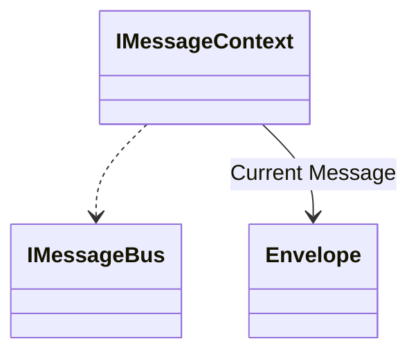

# Sending Messages with IMessageBus

The main entry point into Wolverine to initiate any message handling or publishing is the `IMessageBus` service
that is registered by Wolverine into your application's IoC container as a scoped service. Here's a brief sample
of the most common operations you'll use with `IMessageBus` and Wolverine itself:

There's also a second abstraction called `IMessageContext` that can be optionally consumed
within message handlers to add some extra operations and metadata for the
current message being processed in a handler:



Here's a quick sample usage of the most common operations you'll use with Wolverine:

<!-- snippet: sample_message_bus_basics -->
<a id='snippet-sample_message_bus_basics'></a>
```cs
public static async Task use_message_bus(IMessageBus bus)
{
    // Execute this command message right now! And wait until
    // it's completed or acknowledged
    await bus.InvokeAsync(new DebitAccount(1111, 100));

    // Execute this message right now, but wait for the declared response
    var status = await bus.InvokeAsync<AccountStatus>(new DebitAccount(1111, 250));

    // Send the message expecting there to be at least one subscriber to be executed later, but
    // don't wait around
    await bus.SendAsync(new DebitAccount(1111, 250));

    // Or instead, publish it to any interested subscribers,
    // but don't worry about it if there are actually any subscribers
    // This is probably best for raising event messages
    await bus.PublishAsync(new DebitAccount(1111, 300));

    // Send a message to be sent or executed at a specific time
    await bus.ScheduleAsync(new DebitAccount(1111, 100), DateTimeOffset.UtcNow.AddDays(1));

    // Or do the same, but this time express the time as a delay
    await bus.ScheduleAsync(new DebitAccount(1111, 225), 1.Days());
}
```
<sup><a href='https://github.com/JasperFx/wolverine/blob/main/src/Samples/DocumentationSamples/MessageBusBasics.cs#L8-L35' title='Snippet source file'>snippet source</a> | <a href='#snippet-sample_message_bus_basics' title='Start of snippet'>anchor</a></sup>
<!-- endSnippet -->

::: tip
The only practical difference between `SendAsync()` and `PublishAsync()` is that `SendAsync()` will assert that there is at least
one subscriber for the message and throw an exception if there is not.
:::

## Invoking Message Execution

To execute the message processing immediately and wait until it's finished, use this syntax:

<!-- snippet: sample_invoke_locally -->
<a id='snippet-sample_invoke_locally'></a>
```cs
public static async Task invoke_locally(IMessageBus bus)
{
    // Execute the message inline
    await bus.InvokeAsync(new Message1());
}
```
<sup><a href='https://github.com/JasperFx/wolverine/blob/main/src/Samples/DocumentationSamples/EnqueueSamples.cs#L9-L17' title='Snippet source file'>snippet source</a> | <a href='#snippet-sample_invoke_locally' title='Start of snippet'>anchor</a></sup>
<!-- endSnippet -->

If the `Message1` message has a local subscription, the message handler will be invoked in the calling thread. In this usage, the `InvokeAsync()` feature will utilize any registered [retry or retry with cooldown error handling rules](/guide/handlers/error-handling)
for potentially transient errors.

::: tip
While the syntax for a remote invocation of a message is identical to a local invocation, it's obviously much more expensive
and slower to do so remotely. The Wolverine team recommends using remote invocations cautiously.
:::

If the `Message1` message has a remote subscription (to a Rabbit MQ queue for example), Wolverine will send the message through its
normal transport, but the thread will wait until Wolverine receives an acknowledgement message back from the remote service. In this
case, Wolverine does enforce timeout conditions with a default of 5 seconds which can be overridden by the caller.

## Request/Reply

::: warning
There was a breaking change in behavior for this functionality in Wolverine 3.0. The response type, the `T` in `InvokeAsync<T>()` is **not**
sent as a cascaded message if that type is the requested response type. You will have to explicitly send the response out through `IMessageBus.PublishAsync()`
to force that to be sent out instead of just being the response.
:::

Wolverine also has direct support for the [request/reply](https://www.enterpriseintegrationpatterns.com/RequestReply.html) pattern or really just mediating between your code and complex query handlers through
the `IMessageBus.InvokeAsync<T>()` API. To make that concrete, let's assume you want to request the results of a mathematical operation as shown below
in these message types and a corresponding message handler:

<!-- snippet: sample_numbers_and_results_for_request_response -->
<a id='snippet-sample_numbers_and_results_for_request_response'></a>
```cs
public record Numbers(int X, int Y);

public record Results(int Sum, int Product);

public static class NumbersHandler
{
    public static Results Handle(Numbers numbers)
    {
        return new Results(numbers.X + numbers.Y, numbers.X * numbers.Y);
    }
}
```
<sup><a href='https://github.com/JasperFx/wolverine/blob/main/src/Samples/DocumentationSamples/MessageBusBasics.cs#L81-L95' title='Snippet source file'>snippet source</a> | <a href='#snippet-sample_numbers_and_results_for_request_response' title='Start of snippet'>anchor</a></sup>
<!-- endSnippet -->

Note in the sample above that the message handler that accepts `Numbers` returns a `Results` object. That return value is necessary for Wolverine to be able to
use that handler in a request/reply operation. Finally, to actually invoke the handler and retrieve a `Results` object, we can use the `IMessageBus.InvokeAsync<T>(message)`
API as shown below:

<!-- snippet: sample_using_invoke_with_response_type -->
<a id='snippet-sample_using_invoke_with_response_type'></a>
```cs
public async Task invoke_math_operations(IMessageBus bus)
{
    var results = await bus.InvokeAsync<Results>(new Numbers(3, 4));
}
```
<sup><a href='https://github.com/JasperFx/wolverine/blob/main/src/Samples/DocumentationSamples/MessageBusBasics.cs#L47-L54' title='Snippet source file'>snippet source</a> | <a href='#snippet-sample_using_invoke_with_response_type' title='Start of snippet'>anchor</a></sup>
<!-- endSnippet -->

Note that this API hides whether or not this operation is a local operation running on the same thread and invoking a local message handler or sending a message through to a remote
endpoint and waiting for the response. The same timeout mechanics and performance concerns apply to this operation as the `InvokeAsync()` method described in the previous section.

Note that if you execute the `Numbers` message from above with `InvokeAsync<Results>()`, the `Results` response will only be
returned as the response and will not be published as a message. This was a breaking change in Wolverine 3.0. We think (hope)
that this will be less confusing.

You can explicitly override this behavior on a handler by handler basis with the `[AlwaysPublishResponse]` attribute
as shown below:

<!-- snippet: sample_using_AlwaysPublishResponse -->
<a id='snippet-sample_using_alwayspublishresponse'></a>
```cs
public class CreateItemCommandHandler
{
    // Using this attribute will force Wolverine to also publish the ItemCreated event even if
    // this is called by IMessageBus.InvokeAsync<ItemCreated>()
    [AlwaysPublishResponse]
    public async Task<(ItemCreated, SecondItemCreated)> Handle(CreateItemCommand command, IDocumentSession session)
    {
        var item = new Item
        {
            Id = Guid.NewGuid(),
            Name = command.Name
        };

        session.Store(item);

        return (new ItemCreated(item.Id, item.Name), new SecondItemCreated(item.Id, item.Name));
    }
}
```
<sup><a href='https://github.com/JasperFx/wolverine/blob/main/src/Persistence/MartenTests/Bugs/Bug_305_invoke_async_with_return_not_publishing_with_tuple_return_value.cs#L39-L60' title='Snippet source file'>snippet source</a> | <a href='#snippet-sample_using_alwayspublishresponse' title='Start of snippet'>anchor</a></sup>
<!-- endSnippet -->

## Disabling Remote Request/Reply

When you call `IMessageBus.InvokeAsync()` or `IMessageBus.InvokeAsync<T>()`, depending on whether Wolverine has a local message
handler for the message type or has a configured subscription rule for the message type, Wolverine *might* be making a remote
call through external messaging transports to execute that message. It's a perfectly valid use case to do the remote
invocation, but if you don't want this to ever happen or catch a team by surprise when an operation fails, you can completely
disable all remote request/reply usage through `InvokeAsync()` by changing this setting:

<!-- snippet: sample_disabling_remote_invocation -->
<a id='snippet-sample_disabling_remote_invocation'></a>
```cs
using var host = Host.CreateDefaultBuilder()
    .UseWolverine(opts =>
    {
        // This will disallow Wolverine from making remote calls
        // through IMessageBus.InvokeAsync() or InvokeAsync<T>()
        // Instead, Wolverine will throw an InvalidOperationException
        opts.EnableRemoteInvocation = false;
    }).StartAsync();
```
<sup><a href='https://github.com/JasperFx/wolverine/blob/main/src/Testing/CoreTests/BootstrappingSamples.cs#L25-L36' title='Snippet source file'>snippet source</a> | <a href='#snippet-sample_disabling_remote_invocation' title='Start of snippet'>anchor</a></sup>
<!-- endSnippet -->

## Sending or Publishing Messages

[Publish/Subscribe](https://docs.microsoft.com/en-us/azure/architecture/patterns/publisher-subscriber) is a messaging pattern where the senders of messages do not need to specifically know what the specific subscribers are for a given message. In this case, some kind of middleware or infrastructure is responsible for either allowing subscribers to express interest in what messages they need to receive or apply routing rules to send the published messages to the right places. Wolverine's messaging support was largely built to support the publish/subscribe messaging pattern.

To send a message with Wolverine, use the `IMessageBus` interface or the bigger `IMessageContext` interface that
are registered in your application's IoC container. The sample below shows the most common usage:

<!-- snippet: sample_sending_message_with_servicebus -->
<a id='snippet-sample_sending_message_with_servicebus'></a>
```cs
public ValueTask SendMessage(IMessageContext bus)
{
    // In this case, we're sending an "InvoiceCreated"
    // message
    var @event = new InvoiceCreated
    {
        Time = DateTimeOffset.Now,
        Purchaser = "Guy Fieri",
        Amount = 112.34,
        Item = "Cookbook"
    };

    return bus.SendAsync(@event);
}
```
<sup><a href='https://github.com/JasperFx/wolverine/blob/main/src/Samples/DocumentationSamples/PublishingSamples.cs#L205-L222' title='Snippet source file'>snippet source</a> | <a href='#snippet-sample_sending_message_with_servicebus' title='Start of snippet'>anchor</a></sup>
<!-- endSnippet -->

That by itself will send the `InvoiceCreated` message to whatever subscribers are interested in
that message. The `SendAsync()` method will throw an exception if Wolverine doesn't know where to send the message. In other words,
there has to be a subscriber of some sort for that message.

On the other hand, the `PublishAsync()` method will send a message if there is a known subscriber and ignore the message if there is
no subscriber:

<!-- snippet: sample_publishing_message_with_servicebus -->
<a id='snippet-sample_publishing_message_with_servicebus'></a>
```cs
public ValueTask PublishMessage(IMessageContext bus)
{
    // In this case, we're sending an "InvoiceCreated"
    // message
    var @event = new InvoiceCreated
    {
        Time = DateTimeOffset.Now,
        Purchaser = "Guy Fieri",
        Amount = 112.34,
        Item = "Cookbook"
    };

    return bus.PublishAsync(@event);
}
```
<sup><a href='https://github.com/JasperFx/wolverine/blob/main/src/Samples/DocumentationSamples/PublishingSamples.cs#L225-L242' title='Snippet source file'>snippet source</a> | <a href='#snippet-sample_publishing_message_with_servicebus' title='Start of snippet'>anchor</a></sup>
<!-- endSnippet -->

## Scheduling Message Delivery or Execution

::: tip
While Wolverine has an in memory scheduled delivery and execution model by default, that was only intended for delayed message
execution retries. You will most likely want to either use a transport type that supports native scheduled delivery like
the [Azure Service Bus transport](/guide/messaging/transports/azureservicebus/scheduled), or utilize the [database backed
message persistence](/guide/durability/) to enable durable message scheduling. 
:::

Wolverine supports the concept of scheduled message delivery. Likewise, Wolverine also supports scheduled message execution 
if you're publishing to a [local queue](/guide/messaging/transports/local) within your current application. The actual 
mechanics for message scheduling will vary according to the endpoint destination that a message is being published to, 
including whether or not the scheduled message is durable and will outlive any unexpected or planned process terminations.

::: tip
The built in outbox message scheduling was meant for relatively low numbers of messages, and was primarily meant for scheduled
message retries. If you have an excessive number of scheduled messages, you may want to utilize the database backed queues
in Wolverine which are optimized for much higher number of scheduled messages.
:::

First off, your guide for understanding the scheduled message delivery mechanics in effective order: 

* If the destination endpoint has native message delivery capabilities, Wolverine uses that capability. Outbox mechanics 
  still apply to when the outgoing message is released to the external endpoint's sender
* If the destination endpoint is durable, meaning that it's enrolled in Wolverine's [transactional outbox](/guide/durability/), then Wolverine
  will store the scheduled messages in the outgoing envelope storage for later execution. In this case, Wolverine is polling
  for the ready to execute or deliver messages across all running Wolverine nodes. This option is durable in case of process 
  exits.
* In lieu of any other support, Wolverine has an in memory option that can do scheduled delivery or execution

To schedule message delivery (scheduled execution really just means scheduling message publishing to a local queue), you
actually have a couple different syntactical options. First, if you're directly using the `IMessageBus` interface, you
can schedule a message with a delay using this extension method:

<!-- snippet: sample_ScheduleSend_In_3_Days -->
<a id='snippet-sample_schedulesend_in_3_days'></a>
```cs
public async Task schedule_send(IMessageContext context, Guid issueId)
{
    var timeout = new WarnIfIssueIsStale
    {
        IssueId = issueId
    };

    // Process the issue timeout logic 3 days from now
    await context.ScheduleAsync(timeout, 3.Days());

    // The code above is short hand for this:
    await context.PublishAsync(timeout, new DeliveryOptions
    {
        ScheduleDelay = 3.Days()
    });
}
```
<sup><a href='https://github.com/JasperFx/wolverine/blob/main/src/Samples/DocumentationSamples/ScheduledExecutionSamples.cs#L8-L27' title='Snippet source file'>snippet source</a> | <a href='#snippet-sample_schedulesend_in_3_days' title='Start of snippet'>anchor</a></sup>
<!-- endSnippet -->

Or using an absolute time, with this overload of the extension method:

<!-- snippet: sample_ScheduleSend_At_5_PM_Tomorrow -->
<a id='snippet-sample_schedulesend_at_5_pm_tomorrow'></a>
```cs
public async Task schedule_send_at_5_tomorrow_afternoon(IMessageContext context, Guid issueId)
{
    var timeout = new WarnIfIssueIsStale
    {
        IssueId = issueId
    };

    var time = DateTime.Today.AddDays(1).AddHours(17);

    // Process the issue timeout at 5PM tomorrow
    // Do note that Wolverine quietly converts this
    // to universal time in storage
    await context.ScheduleAsync(timeout, time);
}
```
<sup><a href='https://github.com/JasperFx/wolverine/blob/main/src/Samples/DocumentationSamples/ScheduledExecutionSamples.cs#L29-L47' title='Snippet source file'>snippet source</a> | <a href='#snippet-sample_schedulesend_at_5_pm_tomorrow' title='Start of snippet'>anchor</a></sup>
<!-- endSnippet -->

Now, Wolverine tries really hard to enable you to use [pure functions](https://en.wikipedia.org/wiki/Pure_function) for as many message handlers as possible, so
there's of course an option to schedule message delivery while still using [cascading messages](/guide/handlers/cascading) with the `DelayedFor()` and 
`ScheduledAt()` extension methods shown below:

<!-- snippet: sample_customized_cascaded_messages -->
<a id='snippet-sample_customized_cascaded_messages'></a>
```cs
public static IEnumerable<object> Consume(Incoming incoming)
{
    // Delay the message delivery by 10 minutes
    yield return new Message1().DelayedFor(10.Minutes());

    // Schedule the message delivery for a certain time
    yield return new Message2().ScheduledAt(new DateTimeOffset(DateTime.Today.AddDays(2)));

    // Customize the message delivery however you please...
    yield return new Message3()
        .WithDeliveryOptions(new DeliveryOptions().WithHeader("foo", "bar"));

    // Send back to the original sender
    yield return Respond.ToSender(new Message4());
}
```
<sup><a href='https://github.com/JasperFx/wolverine/blob/main/src/Samples/DocumentationSamples/OutgoingMessagesSample.cs#L37-L55' title='Snippet source file'>snippet source</a> | <a href='#snippet-sample_customized_cascaded_messages' title='Start of snippet'>anchor</a></sup>
<!-- endSnippet -->

Lastly, there's a special base class called `TimeoutMessage` that your message types can extend to add scheduling logic
directly to the message itself for easy usage as a cascaded message. Here's an example message type:

<!-- snippet: sample_OrderTimeout -->
<a id='snippet-sample_ordertimeout'></a>
```cs
// This message will always be scheduled to be delivered after
// a one minute delay
public record OrderTimeout(string Id) : TimeoutMessage(1.Minutes());
```
<sup><a href='https://github.com/JasperFx/wolverine/blob/main/src/Samples/OrderSagaSample/OrderSaga.cs#L12-L18' title='Snippet source file'>snippet source</a> | <a href='#snippet-sample_ordertimeout' title='Start of snippet'>anchor</a></sup>
<!-- endSnippet -->

Which is used within this sample saga implementation:

<!-- snippet: sample_starting_a_saga_inside_a_handler -->
<a id='snippet-sample_starting_a_saga_inside_a_handler'></a>
```cs
// This method would be called when a StartOrder message arrives
// to start a new Order
public static (Order, OrderTimeout) Start(StartOrder order, ILogger<Order> logger)
{
    logger.LogInformation("Got a new order with id {Id}", order.OrderId);

    // creating a timeout message for the saga
    return (new Order{Id = order.OrderId}, new OrderTimeout(order.OrderId));
}
```
<sup><a href='https://github.com/JasperFx/wolverine/blob/main/src/Samples/OrderSagaSample/OrderSaga.cs#L24-L36' title='Snippet source file'>snippet source</a> | <a href='#snippet-sample_starting_a_saga_inside_a_handler' title='Start of snippet'>anchor</a></sup>
<!-- endSnippet -->


## Customizing Message Delivery

TODO -- more text here. NEW PAGE???

<!-- snippet: sample_SendMessagesWithDeliveryOptions -->
<a id='snippet-sample_sendmessageswithdeliveryoptions'></a>
```cs
public static async Task SendMessagesWithDeliveryOptions(IMessageBus bus)
{
    await bus.PublishAsync(new Message1(), new DeliveryOptions
        {
            AckRequested = true,
            ContentType = "text/xml", // you can do this, but I'm not sure why you'd want to override this
            DeliverBy = DateTimeOffset.Now.AddHours(1), // set a message expiration date
            DeliverWithin = 1.Hours(), // convenience method to set the deliver-by expiration date
            ScheduleDelay = 1.Hours(), // Send this in one hour, or...
            ScheduledTime = DateTimeOffset.Now.AddHours(1),
            ResponseType = typeof(Message2) // ask the receiver to send this message back to you if it can
        }
        // There's a chained fluent interface for adding header values too
        .WithHeader("tenant", "one"));
}
```
<sup><a href='https://github.com/JasperFx/wolverine/blob/main/src/Samples/DocumentationSamples/CustomizingMessageDelivery.cs#L9-L27' title='Snippet source file'>snippet source</a> | <a href='#snippet-sample_sendmessageswithdeliveryoptions' title='Start of snippet'>anchor</a></sup>
<!-- endSnippet -->


