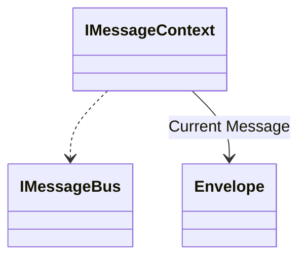

# Publishing and Sending Messages

[Publish/Subscribe](https://docs.microsoft.com/en-us/azure/architecture/patterns/publisher-subscriber) is a messaging pattern where the senders of messages do not need to specifically know what the specific subscribers are for a given message. In this case, some kind of middleware or infrastructure is responsible for either allowing subscribers to express interest in what messages they need to receive or apply routing rules to send the published messages to the right places. Wolverine's messaging support was largely built to support the publish/subscibe messaging patterm.



To send a message with Wolverine, use the `IMessageBus` interface or the bigger `IMessageContext` interface that
are registered in your application's IoC container. The sample below shows the most common usage:

<!-- snippet: sample_sending_message_with_servicebus -->
<a id='snippet-sample_sending_message_with_servicebus'></a>
```cs
public ValueTask SendMessage(IMessageContext bus)
{
    // In this case, we're sending an "InvoiceCreated"
    // message
    var @event = new InvoiceCreated
    {
        Time = DateTimeOffset.Now,
        Purchaser = "Guy Fieri",
        Amount = 112.34,
        Item = "Cookbook"
    };

    return bus.SendAsync(@event);
}
```
<sup><a href='https://github.com/JasperFx/wolverine/blob/main/src/Samples/DocumentationSamples/PublishingSamples.cs#L167-L184' title='Snippet source file'>snippet source</a> | <a href='#snippet-sample_sending_message_with_servicebus' title='Start of snippet'>anchor</a></sup>
<!-- endSnippet -->

That by itself will send the `InvoiceCreated` message to whatever subscribers are interested in
that message. The `SendAsync()` method will throw an exception if Wolverine doesn't know where to send the message. In other words,
there has to be a subscriber of some sort for that message.

On the other hand, the `PublishAsync()` method will send a message if there is a known subscriber and ignore the message if there is
no subscriber:

<!-- snippet: sample_publishing_message_with_servicebus -->
<a id='snippet-sample_publishing_message_with_servicebus'></a>
```cs
public ValueTask PublishMessage(IMessageContext bus)
{
    // In this case, we're sending an "InvoiceCreated"
    // message
    var @event = new InvoiceCreated
    {
        Time = DateTimeOffset.Now,
        Purchaser = "Guy Fieri",
        Amount = 112.34,
        Item = "Cookbook"
    };

    return bus.PublishAsync(@event);
}
```
<sup><a href='https://github.com/JasperFx/wolverine/blob/main/src/Samples/DocumentationSamples/PublishingSamples.cs#L187-L204' title='Snippet source file'>snippet source</a> | <a href='#snippet-sample_publishing_message_with_servicebus' title='Start of snippet'>anchor</a></sup>
<!-- endSnippet -->

## Send Messages to a Specific Endpoint

You can also explicitly send any message to a named endpoint in the system. You might
do this to programmatically distribute work in your system, or when you need to do more
programmatic routing as to what downstream system should handle the outgoing message.

Regardless, that usage is shown below. Just note that you can give a name to any type
of Wolverine endpoint:

<!-- snippet: sample_sending_to_endpoint_by_name -->
<a id='snippet-sample_sending_to_endpoint_by_name'></a>
```cs
using var host = await Host.CreateDefaultBuilder()
    .UseWolverine(opts =>
    {
        opts.PublishAllMessages().ToPort(5555)
            .Named("One");

        opts.PublishAllMessages().ToPort(5555)
            .Named("Two");
    }).StartAsync();

var publisher = host.Services
    .GetRequiredService<IMessageBus>();

// Explicitly send a message to a named endpoint
await publisher.EndpointFor("One").SendAsync( new SomeMessage());
```
<sup><a href='https://github.com/JasperFx/wolverine/blob/main/src/Samples/DocumentationSamples/PublishingSamples.cs#L54-L72' title='Snippet source file'>snippet source</a> | <a href='#snippet-sample_sending_to_endpoint_by_name' title='Start of snippet'>anchor</a></sup>
<!-- endSnippet -->

TODO -- link to endpoint configuration. Make sure it explains how to

## Send Messages to a Specific Topic

If you're using a transport endpoint that supports publishing messages by topic
such as this example using Rabbit MQ from the Wolverine tests:

<!-- snippet: sample_binding_topics_and_topic_patterns_to_queues -->
<a id='snippet-sample_binding_topics_and_topic_patterns_to_queues'></a>
```cs
theSender = Host.CreateDefaultBuilder()
    .UseWolverine(opts =>
    {
        opts.UseRabbitMq().AutoProvision();
        opts.PublishAllMessages().ToRabbitTopics("wolverine.topics", exchange =>
        {
            exchange.BindTopic("color.green").ToQueue("green");
            exchange.BindTopic("color.blue").ToQueue("blue");
            exchange.BindTopic("color.*").ToQueue("all");
        });
    }).Start();
```
<sup><a href='https://github.com/JasperFx/wolverine/blob/main/src/Transports/Wolverine.RabbitMQ.Tests/send_by_topics.cs#L24-L38' title='Snippet source file'>snippet source</a> | <a href='#snippet-sample_binding_topics_and_topic_patterns_to_queues' title='Start of snippet'>anchor</a></sup>
<!-- endSnippet -->

You can explicitly publish a message to a topic through this syntax:

<!-- snippet: sample_send_to_topic -->
<a id='snippet-sample_send_to_topic'></a>
```cs
var publisher = theSender.Services
    .GetRequiredService<IMessageBus>();

await publisher.BroadcastToTopicAsync("color.purple", new Message1());
```
<sup><a href='https://github.com/JasperFx/wolverine/blob/main/src/Transports/Wolverine.RabbitMQ.Tests/send_by_topics.cs#L72-L79' title='Snippet source file'>snippet source</a> | <a href='#snippet-sample_send_to_topic' title='Start of snippet'>anchor</a></sup>
<!-- endSnippet -->


## Scheduling Message Delivery

TODO -- write stuff here

## Customizing Message Delivery

TODO -- more text here

<!-- snippet: sample_SendMessagesWithDeliveryOptions -->
<a id='snippet-sample_sendmessageswithdeliveryoptions'></a>
```cs
public static async Task SendMessagesWithDeliveryOptions(IMessageBus bus)
{
    await bus.PublishAsync(new Message1(), new DeliveryOptions
        {
            AckRequested = true,
            ContentType = "text/xml", // you can do this, but I'm not sure why you'd want to override this
            DeliverBy = DateTimeOffset.Now.AddHours(1), // set a message expiration date
            DeliverWithin = 1.Hours(), // convenience method to set the deliver-by expiration date
            ScheduleDelay = 1.Hours(), // Send this in one hour, or...
            ScheduledTime = DateTimeOffset.Now.AddHours(1),
            ResponseType = typeof(Message2) // ask the receiver to send this message back to you if it can
        }
        // There's a chained fluent interface for adding header values too
        .WithHeader("tenant", "one"));
}
```
<sup><a href='https://github.com/JasperFx/wolverine/blob/main/src/Samples/DocumentationSamples/CustomizingMessageDelivery.cs#L9-L27' title='Snippet source file'>snippet source</a> | <a href='#snippet-sample_sendmessageswithdeliveryoptions' title='Start of snippet'>anchor</a></sup>
<!-- endSnippet -->


