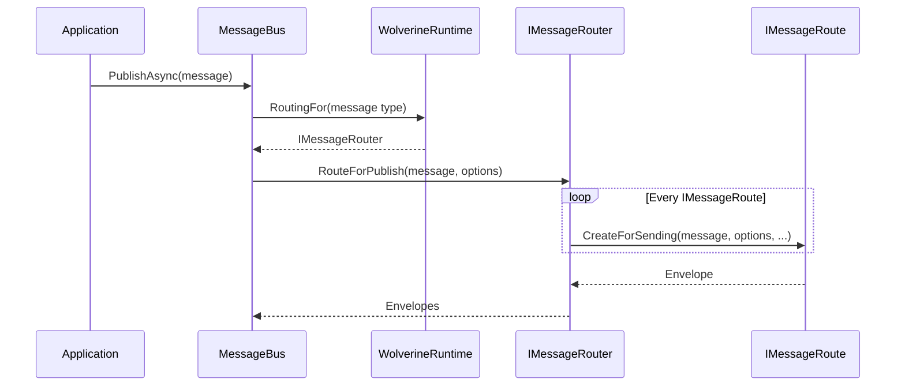
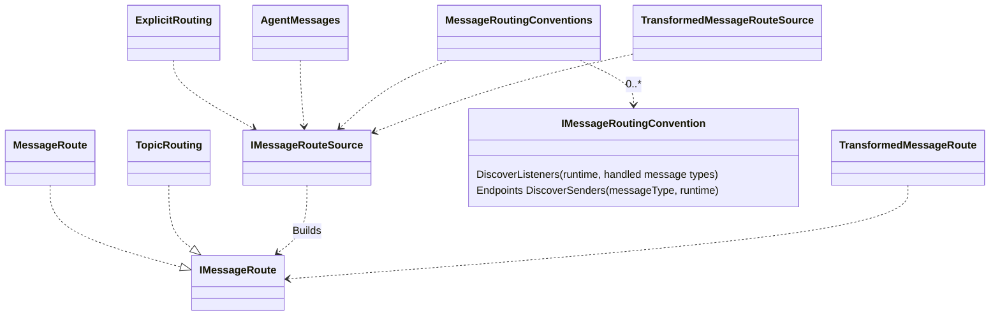

# Message Routing

When you publish a message using `IMessageBus` or `IMessageContext`, Wolverine uses its concept of subscriptions to know how and where to send the message. Consider this code that publishes a
`PingMessage`:

<!-- snippet: sample_sending_messages_for_static_routing -->
<a id='snippet-sample_sending_messages_for_static_routing'></a>
```cs
public class SendingExample
{
    public async Task SendPingsAndPongs(IMessageContext bus)
    {
        // Publish a message
        await bus.SendAsync(new PingMessage());
    }
}
```
<sup><a href='https://github.com/JasperFx/wolverine/blob/main/src/Testing/CoreTests/Runtime/Samples/channels.cs#L5-L16' title='Snippet source file'>snippet source</a> | <a href='#snippet-sample_sending_messages_for_static_routing' title='Start of snippet'>anchor</a></sup>
<!-- endSnippet -->

## Routing Rules

::: info
There are some special message type routing for some Wolverine internal messages and the Marten event forwarding through its `IEvent<T>` wrappers.
Because of course there are some oddball exception cases.
:::

When sending, publishing, scheduling, or invoking a message type for the first time, Wolverine runs through
a series of rules to determine what endpoint(s) subscribe to the message type. Those rules in order of precedence
are:

1. Is the message type "forwarded" to another message type? If so, the routing uses the destination type. See [message forwarding](/guide/messages.html#versioned-message-forwarding) for more information.
2. Are there any explicit routing rules that apply to this message type? If so, use *only* the subscriptions discovered from explicit rules (as explained in a following section). 
3. Use a local subscription using the conventional local queue routing if the message type has a known message handler within the application. This [conventional routing to local queues can be disabled](/guide/messaging/transports/local.html#disable-conventional-local-routing) or made "additive" so that Wolverine *also* applies other conventional routing. 
4. Any registered message routing conventions like the Rabbit MQ or Amazon SQS routing conventions or a user defined routing convention.

## Diagnostics

There's admittedly a lot of switches and options for message routing, and it's quite possible that the actual behavior could
be confusing, especially with unusual configuration usages. Not to worry (too much), because Wolverine gives you a couple
options to preview exactly what the subscriptions are for a given message type you can use to check your understanding
of the Wolverine configuration.

Programmatically, this code shows how to "look" into the configured Wolverine subscriptions for a message type:

<!-- snippet: sample_PreviewRouting_programmatically -->
<a id='snippet-sample_previewrouting_programmatically'></a>
```cs
public static void PreviewRouting(IHost host)
{
    // In test projects, you would probably have access to the IHost for 
    // the running application

    // First, get access to the Wolverine runtime for the application
    // It's registered by Wolverine as a singleton in your IoC container
    var runtime = host.Services.GetRequiredService<IWolverineRuntime>();
    
    var router = runtime.RoutingFor(typeof(MyMessage));
    
    // If using Wolverine 3.6 or later when we added more
    // ToString() behavior for exactly this reason
    foreach (var messageRoute in router.Routes)
    {
        Debug.WriteLine(messageRoute);
    }
    
    // Otherwise, you might have to do this to "see" where
    // the routing is going
    foreach (var route in router.Routes.OfType<MessageRoute>())
    {
        Debug.WriteLine(route.Sender.Destination);
    }
}
```
<sup><a href='https://github.com/JasperFx/wolverine/blob/main/src/Testing/MessageRoutingTests/MessageRoutingContext.cs#L85-L113' title='Snippet source file'>snippet source</a> | <a href='#snippet-sample_previewrouting_programmatically' title='Start of snippet'>anchor</a></sup>
<!-- endSnippet -->

First, you can always use the [command line support](/guide/command-line) to preview Wolverine's known message types by using:

```bash
dotnet run -- describe
```

You might have to scroll a little bit, but there is a section that previews message subscriptions by type as a tabular
output from that command. 

::: tip
The command line preview can only show subscriptions for the message types that Wolverine "knows" it will try to send
at bootstrapping time. See [Message Discovery](/guide/messages.html#message-discovery) for how to better utilize this
preview functionality by "telling" Wolverine what your outgoing message types are.
:::

## Explicit Subscriptions

To route messages to specific endpoints, we can apply static message routing rules by using a routing rule as shown below:

<!-- snippet: sample_StaticPublishingRules -->
<a id='snippet-sample_staticpublishingrules'></a>
```cs
using var host = Host.CreateDefaultBuilder()
    .UseWolverine(opts =>
    {
        // Route a single message type
        opts.PublishMessage<PingMessage>()
            .ToServerAndPort("server", 1111);

        // Send every possible message to a TCP listener
        // on this box at port 2222
        opts.PublishAllMessages().ToPort(2222);

        // Or use a more fluent interface style
        opts.Publish().MessagesFromAssembly(typeof(PingMessage).Assembly)
            .ToPort(3333);

        // Complicated rules, I don't think folks will use this much
        opts.Publish(rule =>
        {
            // Apply as many message matching
            // rules as you need

            // Specific message types
            rule.Message<PingMessage>();
            rule.Message<Message1>();

            // Implementing a specific marker interface or common base class
            rule.MessagesImplementing<IEventMarker>();

            // All types in a certain assembly
            rule.MessagesFromAssemblyContaining<PingMessage>();

            // or this
            rule.MessagesFromAssembly(typeof(PingMessage).Assembly);

            // or by namespace
            rule.MessagesFromNamespace("MyMessageLibrary");
            rule.MessagesFromNamespaceContaining<PingMessage>();

            // Express the subscribers
            rule.ToPort(1111);
            rule.ToPort(2222);
        });

        // Or you just send all messages to a certain endpoint
        opts.PublishAllMessages().ToPort(3333);
    }).StartAsync();
```
<sup><a href='https://github.com/JasperFx/wolverine/blob/main/src/Samples/DocumentationSamples/StaticPublishingRule.cs#L12-L61' title='Snippet source file'>snippet source</a> | <a href='#snippet-sample_staticpublishingrules' title='Start of snippet'>anchor</a></sup>
<!-- endSnippet -->

Do note that doing the message type filtering by namespace will also include child namespaces. In
our own usage we try to rely on either namespace rules or by using shared message assemblies.

## Disabling Local Routing

Hey, it's perfectly possible that you want all messages going through external message brokers even when the message types
all have known message handlers in the application. To do that, simply disable the automatic local message routing like this:

<!-- snippet: sample_disable_local_queue_routing -->
<a id='snippet-sample_disable_local_queue_routing'></a>
```cs
public static async Task disable_queue_routing()
{
    using var host = await Host.CreateDefaultBuilder()
        .UseWolverine(opts =>
        {
            // This will disable the conventional local queue
            // routing that would take precedence over other conventional
            // routing
            opts.Policies.DisableConventionalLocalRouting();

            // Other routing conventions. Rabbit MQ? SQS?
        }).StartAsync();
```
<sup><a href='https://github.com/JasperFx/wolverine/blob/main/src/Samples/DocumentationSamples/LocalQueueMessage.cs#L16-L31' title='Snippet source file'>snippet source</a> | <a href='#snippet-sample_disable_local_queue_routing' title='Start of snippet'>anchor</a></sup>
<!-- endSnippet -->

This does allow you to possibly do better load balancing between
application nodes.

## Using Both Local Routing and External Broker Conventional Routing <Badge type="tip" text="3.6" />

You may want *both* the local routing conventions and external routing conventions to apply to the same
message type. An early Wolverine user needed to both handle an event message created by their application locally inside
that application (through a local queue), and to publish the same event message through external brokers to a different
system. You can now make the local routing conventions be "additive" such that the message routing will also use external
routing conventions even with local handlers like this:

<!-- snippet: sample_additive_local_and_external_routing_conventions -->
<a id='snippet-sample_additive_local_and_external_routing_conventions'></a>
```cs
var builder = Host.CreateApplicationBuilder();
builder.UseWolverine(opts =>
{
    var rabbitConnectionString = builder
        .Configuration.GetConnectionString("rabbitmq");

    opts.UseRabbitMq(rabbitConnectionString)
        .AutoProvision()

        // Using the built in, default Rabbit MQ message routing conventions
        .UseConventionalRouting();
    
    // Allow Wolverine to *also* apply the Rabbit MQ conventional
    // routing to message types that this system can handle locally
    opts.Policies.ConventionalLocalRoutingIsAdditive();
});
```
<sup><a href='https://github.com/JasperFx/wolverine/blob/main/src/Testing/MessageRoutingTests/using_additive_local_routing_and_external_conventions.cs#L13-L32' title='Snippet source file'>snippet source</a> | <a href='#snippet-sample_additive_local_and_external_routing_conventions' title='Start of snippet'>anchor</a></sup>
<!-- endSnippet -->

## Routing Internals

Wolverine has an internal model called `IMessageRoute` that models a subscription
for a message type that "knows" how to create the Wolverine `Envelope` for a single
outgoing message to a single subscribing endpoint:

<!-- snippet: sample_IMessageRoute -->
<a id='snippet-sample_imessageroute'></a>
```cs
/// <summary>
/// Contains all the rules for where and how an outgoing message
/// should be sent to a single subscriber
/// </summary>
public interface IMessageRoute
{
    Envelope CreateForSending(object message, DeliveryOptions? options, ISendingAgent localDurableQueue,
        WolverineRuntime runtime, string? topicName);

    SubscriptionDescriptor Describe();
}
```
<sup><a href='https://github.com/JasperFx/wolverine/blob/main/src/Wolverine/Runtime/Routing/IMessageRoute.cs#L7-L21' title='Snippet source file'>snippet source</a> | <a href='#snippet-sample_imessageroute' title='Start of snippet'>anchor</a></sup>
<!-- endSnippet -->

This type "knows" about any endpoint or model sending customizations like delivery expiration
rules or in some cases, some user defined logic to determine the topic name for the message
at runtime for message broker endpoints that support topic based publishing. 

At runtime, when you decide to publish a message (and this applies to cascading messages in handlers),
the workflow in the Wolverine internals is below:



As to *how* Wolverine determines the message routing, the internals are shown below:



Wolverine has a handful of built in `IMessageRouteSource` implementations in precedence order:

1. `TransformedMessageRouteSource` - only really used by the Marten event sourcing support to "know" to forward messages of type `IEvent<T>` to the event type `T`
2. `AgentMessages` - just for Wolverine's own internal `IAgentCommand` commands
3. `ExplicitRouting` - explicitly defined subscriptions rules from the Wolverine fluent interface (`PublishMessage<Foo>().ToRabbitQueue("foo")`)
4. `LocalRouting` - if a message type has a known handler type in the system, Wolverine will route the message to any local queues for that message type
5. `MessageRoutingConventions` - this would be any message routing conventions enabled for external transport brokers like Rabbit MQ or Azure Service Bus. This could also be a custom message routing convention.

## Rolling Your own Messaging Convention

Let's say you want to use a completely different conventional routing topology than anything Wolverine provides out
of the box. You can do that by creating your own implementation of this interface:

<!-- snippet: sample_IMessageRoutingConvention -->
<a id='snippet-sample_imessageroutingconvention'></a>
```cs
/// <summary>
///     Plugin for doing any kind of conventional message routing
/// </summary>
public interface IMessageRoutingConvention
{
    /// <summary>
    /// Use this to define listening endpoints based on the known message handlers for the application
    /// </summary>
    /// <param name="runtime"></param>
    /// <param name="handledMessageTypes"></param>
    void DiscoverListeners(IWolverineRuntime runtime, IReadOnlyList<Type> handledMessageTypes);
    
    /// <summary>
    /// Create outgoing subscriptions for the application for the given message type
    /// </summary>
    /// <param name="messageType"></param>
    /// <param name="runtime"></param>
    /// <returns></returns>
    IEnumerable<Endpoint> DiscoverSenders(Type messageType, IWolverineRuntime runtime);
}
```
<sup><a href='https://github.com/JasperFx/wolverine/blob/main/src/Wolverine/Runtime/Routing/IMessageRoutingConvention.cs#L5-L28' title='Snippet source file'>snippet source</a> | <a href='#snippet-sample_imessageroutingconvention' title='Start of snippet'>anchor</a></sup>
<!-- endSnippet -->

As a concrete example, the Wolverine team received [this request](https://github.com/JasperFx/wolverine/issues/1130) to conventionally route messages based on 
the message type name to a [Rabbit MQ exchange and routing key](https://www.rabbitmq.com/tutorials/tutorial-four-dotnet).
That's not something that Wolverine supports out of the box, but you could build your own simplistic routing
convention like this:

<!-- snippet: sample_RouteKeyConvention -->
<a id='snippet-sample_routekeyconvention'></a>
```cs
public class RouteKeyConvention : IMessageRoutingConvention
{
    private readonly string _exchangeName;

    public RouteKeyConvention(string exchangeName)
    {
        _exchangeName = exchangeName;
    }

    public void DiscoverListeners(IWolverineRuntime runtime, IReadOnlyList<Type> handledMessageTypes)
    {
        // Not worrying about this at all for this case
    }

    public IEnumerable<Endpoint> DiscoverSenders(Type messageType, IWolverineRuntime runtime)
    {
        var routingKey = messageType.FullNameInCode().ToLowerInvariant();
        var rabbitTransport = runtime.Options.Transports.GetOrCreate<RabbitMqTransport>();

        // Find or create the named Rabbit MQ exchange in Wolverine's model
        var exchange = rabbitTransport.Exchanges[_exchangeName];
        
        // Find or create the named routing key / binding key
        // in Wolverine's model
        var routing = exchange.Routings[routingKey];

        // Tell Wolverine you want the message type routed to this
        // endpoint
        yield return routing;
    }
}
```
<sup><a href='https://github.com/JasperFx/wolverine/blob/main/src/Transports/RabbitMQ/Wolverine.RabbitMQ.Tests/RouteKeyConvention.cs#L11-L45' title='Snippet source file'>snippet source</a> | <a href='#snippet-sample_routekeyconvention' title='Start of snippet'>anchor</a></sup>
<!-- endSnippet -->

And register it to your Wolverine application like so:

<!-- snippet: sample_register_RouteKeyConvention -->
<a id='snippet-sample_register_routekeyconvention'></a>
```cs
var builder = Host.CreateApplicationBuilder();
var rabbitConnectionString = builder
    .Configuration
    .GetConnectionString("rabbitmq");

builder.UseWolverine(opts =>
{
    opts.UseRabbitMq(rabbitConnectionString)
        .AutoProvision();

    var exchangeName = builder
        .Configuration
        .GetValue<string>("exchange-name");

    opts.RouteWith(new RouteKeyConvention(exchangeName));
});

// actually start the app...
```
<sup><a href='https://github.com/JasperFx/wolverine/blob/main/src/Transports/RabbitMQ/Wolverine.RabbitMQ.Tests/RouteKeyConvention.cs#L51-L72' title='Snippet source file'>snippet source</a> | <a href='#snippet-sample_register_routekeyconvention' title='Start of snippet'>anchor</a></sup>
<!-- endSnippet -->


