# Wolverine.EntityFrameworkCore Internals

This document describes the internal architecture of the `Wolverine.EntityFrameworkCore` project, which integrates Entity Framework Core with Wolverine's message handling pipeline.

## Overview

The project implements the **transactional outbox pattern** for EF Core. When a message handler modifies domain entities via a `DbContext`, any outgoing messages are persisted to the same database within the same transaction. After commit, Wolverine flushes the persisted messages to their transport destinations. This guarantees that database changes and message publishing are atomic — either both happen or neither does.

The project also provides:

- **Saga persistence** via EF Core (load, insert, update, delete)
- **Multi-tenancy** with per-tenant `DbContext` creation (by connection string or `DbDataSource`)
- **Domain event publishing** by scraping entities from the EF Core `ChangeTracker`
- **Idempotency** via inbox tracking of processed messages
- **Code generation** frames that compile into Wolverine's JIT-generated handler pipelines

## Class Diagram

```mermaid
classDiagram
    direction TB

    %% ── Interfaces ──────────────────────────────────────────────
    class IMessageBus {
        <<interface>>
    }

    class IDbContextOutbox {
        <<interface>>
        +DbContext ActiveContext
        +Enroll(DbContext)
        +SaveChangesAndFlushMessagesAsync()
        +FlushOutgoingMessagesAsync()
    }

    class IDbContextOutbox~T~ {
        <<interface>>
        +T DbContext
        +SaveChangesAndFlushMessagesAsync()
        +FlushOutgoingMessagesAsync()
    }

    class IDbContextOutboxFactory {
        <<interface>>
        +CreateForTenantAsync~T~(tenantId)
    }

    class IEnvelopeTransaction {
        <<interface>>
        +PersistOutgoingAsync(Envelope)
        +PersistIncomingAsync(Envelope)
        +CommitAsync()
        +RollbackAsync()
    }

    class IDbContextBuilder {
        <<interface>>
        +BuildForMain() DbContext
        +DbContextType Type
        +ApplyAllChangesToDatabasesAsync()
    }

    class IDbContextBuilder~T~ {
        <<interface>>
        +BuildAndEnrollAsync(MessageContext, CancellationToken)
        +BuildAsync(tenantId)
        +BuildOptionsForMain()
    }

    class IDomainEventScraper {
        <<interface>>
        +ScrapeEvents(DbContext, MessageContext)
    }

    class IPersistenceFrameProvider {
        <<interface>>
        +CanPersist(entityType, chain, out dbContextType)
        +DetermineLoadFrame()
        +DetermineInsertFrame()
        +DetermineUpdateFrame()
        +DetermineDeleteFrame()
        +CommitUnitOfWorkFrame()
        +ApplyTransactionSupport()
    }

    class IWolverineExtension {
        <<interface>>
        +Configure(WolverineOptions)
    }

    %% ── Implementations ─────────────────────────────────────────
    class MessageContext {
        <<Wolverine.Runtime>>
    }

    class DbContextOutbox {
        -IDomainEventScraper[] _scrapers
        +DbContext ActiveContext
        +Enroll(DbContext)
        +SaveChangesAndFlushMessagesAsync()
    }

    class DbContextOutbox~T~ {
        -IDomainEventScraper[] _scrapers
        +T DbContext
        +SaveChangesAndFlushMessagesAsync()
    }

    class DbContextOutboxFactory {
        -IWolverineRuntime _runtime
        +CreateForTenantAsync~T~(tenantId)
    }

    class EfCoreEnvelopeTransaction {
        -DbContext _dbContext
        -MessageContext _messaging
        -IDomainEventScraper[] _scrapers
        +PersistOutgoingAsync(Envelope)
        +PersistIncomingAsync(Envelope)
        +CommitAsync()
        +RollbackAsync()
        +TryMakeEagerIdempotencyCheckAsync()
    }

    class TenantedDbContextBuilderByConnectionString~T~ {
        -IServiceProvider _services
        -MultiTenantedMessageStore _store
        +BuildAndEnrollAsync(MessageContext, CancellationToken)
        +BuildAsync(tenantId)
        +ApplyAllChangesToDatabasesAsync()
    }

    class TenantedDbContextBuilderByDbDataSource~T~ {
        -IServiceProvider _services
        -MultiTenantedMessageStore _store
        +BuildAndEnrollAsync(MessageContext, CancellationToken)
        +BuildAsync(tenantId)
        +ApplyAllChangesToDatabasesAsync()
    }

    %% ── Entity Models ───────────────────────────────────────────
    class IncomingMessage {
        +Guid Id
        +string Status
        +int OwnerId
        +DateTimeOffset ExecutionTime
        +int Attempts
        +byte[] Body
        +string MessageType
        +Uri ReceivedAt
        +DateTimeOffset KeepUntil
    }

    class OutgoingMessage {
        +Guid Id
        +int OwnerId
        +Uri Destination
        +DateTimeOffset DeliverBy
        +byte[] Body
        +int Attempts
        +string MessageType
    }

    %% ── Domain Events ───────────────────────────────────────────
    class OutgoingDomainEvents {
        <<OutgoingMessages>>
    }

    class OutgoingDomainEventsScraper {
        -OutgoingDomainEvents _events
        +ScrapeEvents(DbContext, MessageContext)
    }

    class DomainEventScraper~T,TEvent~ {
        -Func source
        +ScrapeEvents(DbContext, MessageContext)
    }

    %% ── Code Generation Frames ──────────────────────────────────
    class EFCorePersistenceFrameProvider {
        +CanPersist(entityType, chain, out dbContextType)
        +DetermineLoadFrame()
        +DetermineInsertFrame()
        +DetermineUpdateFrame()
        +DetermineDeleteFrame()
        +CommitUnitOfWorkFrame()
        +ApplyTransactionSupport()
    }

    class EnrollDbContextInTransaction {
        <<AsyncFrame>>
        -Type _dbContextType
    }

    class StartDatabaseTransactionForDbContext {
        <<AsyncFrame>>
        -Type _dbContextType
    }

    class LoadEntityFrame {
        <<AsyncFrame>>
        -Type _dbContextType
        -Type _sagaType
    }

    class DbContextOperationFrame {
        <<SyncFrame>>
        -string _methodName
    }

    %% ── Bootstrap ───────────────────────────────────────────────
    class EntityFrameworkCoreBackedPersistence {
        +Configure(WolverineOptions)
    }

    class EntityFrameworkCoreBackedPersistence~T~ {
        +Configure(WolverineOptions)
    }

    class WolverineModelCustomizer {
        +Customize(ModelBuilder, DbContext)
    }

    class WolverineEntityCoreExtensions {
        <<static>>
        +AddDbContextWithWolverineIntegration~T~()$
        +AddDbContextWithWolverineManagedMultiTenancy~T~()$
        +UseEntityFrameworkCoreTransactions()$
        +MapWolverineEnvelopeStorage()$
        +PublishDomainEventsFromEntityFrameworkCore()$
    }

    %% ── Inheritance / Implementation ────────────────────────────
    IDbContextOutbox --|> IMessageBus
    IDbContextOutbox~T~ --|> IMessageBus
    IDbContextBuilder~T~ --|> IDbContextBuilder

    DbContextOutbox --|> MessageContext
    DbContextOutbox ..|> IDbContextOutbox
    DbContextOutbox~T~ --|> MessageContext
    DbContextOutbox~T~ ..|> IDbContextOutbox~T~

    DbContextOutboxFactory ..|> IDbContextOutboxFactory
    EfCoreEnvelopeTransaction ..|> IEnvelopeTransaction
    EFCorePersistenceFrameProvider ..|> IPersistenceFrameProvider
    EntityFrameworkCoreBackedPersistence ..|> IWolverineExtension
    EntityFrameworkCoreBackedPersistence~T~ ..|> IWolverineExtension

    TenantedDbContextBuilderByConnectionString~T~ ..|> IDbContextBuilder~T~
    TenantedDbContextBuilderByDbDataSource~T~ ..|> IDbContextBuilder~T~

    OutgoingDomainEventsScraper ..|> IDomainEventScraper
    DomainEventScraper~T,TEvent~ ..|> IDomainEventScraper

    %% ── Composition / Dependencies ──────────────────────────────
    DbContextOutbox~T~ --> EfCoreEnvelopeTransaction : creates
    DbContextOutbox --> EfCoreEnvelopeTransaction : creates
    EfCoreEnvelopeTransaction --> IncomingMessage : persists
    EfCoreEnvelopeTransaction --> OutgoingMessage : persists
    EfCoreEnvelopeTransaction --> IDomainEventScraper : invokes

    DbContextOutboxFactory --> IDbContextBuilder~T~ : resolves
    DbContextOutboxFactory --> DbContextOutbox~T~ : creates

    EFCorePersistenceFrameProvider --> LoadEntityFrame : creates
    EFCorePersistenceFrameProvider --> DbContextOperationFrame : creates
    EFCorePersistenceFrameProvider --> EnrollDbContextInTransaction : creates
    EFCorePersistenceFrameProvider --> StartDatabaseTransactionForDbContext : creates

    EntityFrameworkCoreBackedPersistence~T~ --> EFCorePersistenceFrameProvider : registers
    WolverineModelCustomizer --> IncomingMessage : maps
    WolverineModelCustomizer --> OutgoingMessage : maps
```



## Key Subsystems

### 1. Transactional Outbox

The core of the project is the transactional outbox, implemented by `EfCoreEnvelopeTransaction`. When a Wolverine message handler runs inside an EF Core transaction:

1. The handler modifies entities on the `DbContext`.
2. Outgoing messages are captured as `OutgoingMessage` entities on the same `DbContext`.
3. The incoming message is recorded as an `IncomingMessage` (for idempotency).
4. On commit, everything is saved in a single database transaction.
5. After the transaction commits, outgoing messages are flushed to their transport destinations.

If the `DbContext` has Wolverine's entity mappings (via `MapWolverineEnvelopeStorage()`), messages are persisted as EF Core entities. Otherwise, raw SQL commands are built using `DatabasePersistence` utilities from `Wolverine.RDBMS`.

### 2. Outbox Entry Points

There are two ways to use the outbox:

- **`IDbContextOutbox<T>`** (generic) — Injected when you know the `DbContext` type at compile time. Wraps a specific `DbContext` instance.
- **`IDbContextOutbox`** (non-generic) — Injected when the `DbContext` type isn't known until runtime. Call `Enroll(dbContext)` to attach any `DbContext`.

Both extend `MessageContext`, so they function as full Wolverine message buses with outbox semantics. Calling `SaveChangesAndFlushMessagesAsync()` saves entity changes and flushes outgoing messages atomically.

### 3. Code Generation

Wolverine compiles message handler pipelines at startup using JasperFx code generation. The `EFCorePersistenceFrameProvider` plugs into this system:

- **`EnrollDbContextInTransaction`** — Generated middleware frame for non-multi-tenanted DbContexts. Creates the `EfCoreEnvelopeTransaction`, begins a DB transaction, runs the handler, and commits or rolls back.
- **`StartDatabaseTransactionForDbContext`** — Generated middleware frame for multi-tenanted DbContexts. The DbContext is created via `IDbContextBuilder<T>.BuildAndEnrollAsync()` earlier in the pipeline.
- **`LoadEntityFrame`** — Generates `await dbContext.FindAsync<T>(id)` to load sagas.
- **`DbContextOperationFrame`** — Generates `dbContext.Add()`, `dbContext.Update()`, or `dbContext.Remove()` calls for saga persistence.

### 4. Multi-Tenancy

Two builder implementations resolve per-tenant DbContexts:

- **`TenantedDbContextBuilderByConnectionString<T>`** — Resolves a connection string per tenant from the `MultiTenantedMessageStore`, then constructs a `DbContext` with tenant-specific `DbContextOptions`.
- **`TenantedDbContextBuilderByDbDataSource<T>`** — Same pattern but resolves a `DbDataSource` per tenant, used when integrating with Marten's data source management.

Both builders cache resolved connections and use `FastExpressionCompiler` to compile efficient `DbContext` constructors at runtime. The `TenantedDbContextInitializer<T>` hooks into Wolverine's resource management to apply migrations across all tenant databases at startup.

### 5. Domain Event Publishing

Domain events are extracted from entity changes before the transaction commits:

- **`OutgoingDomainEventsScraper`** — Takes events from an `OutgoingDomainEvents` collection (populated manually by handler code) and enqueues them.
- **`DomainEventScraper<T, TEvent>`** — Scans the `ChangeTracker` for entities of type `T`, extracts events via a configured function, and publishes them.

Scrapers implement `IDomainEventScraper` and are invoked by `EfCoreEnvelopeTransaction.CommitAsync()` just before the database transaction commits.

### 6. EF Core Model Integration

`WolverineModelCustomizer` extends EF Core's `RelationalModelCustomizer` to add entity mappings for `IncomingMessage` and `OutgoingMessage` to any `DbContext` that opts in via `MapWolverineEnvelopeStorage()`. This allows Wolverine's envelope storage tables to coexist with application tables in the same database and participate in the same EF Core migrations.

## Transaction Flow

### Non-Multi-Tenanted Handler

```
Request arrives
  → EnrollDbContextInTransaction (generated middleware)
    → Resolve DbContext from DI
    → Create EfCoreEnvelopeTransaction
    → Begin DB transaction
    → [Optional] Eager idempotency check (insert IncomingMessage)
    → Execute handler (modifies entities, sends messages)
    → EfCoreEnvelopeTransaction.CommitAsync()
      → Scrape domain events from ChangeTracker
      → Persist OutgoingMessage entities
      → Mark IncomingMessage as handled
      → DbContext.SaveChangesAsync()
      → DB transaction commits
      → Flush outgoing messages to transports
```

### Multi-Tenanted Handler

```
Request arrives
  → CreateTenantedDbContext<T> (generated frame)
    → IDbContextBuilder<T>.BuildAndEnrollAsync()
      → Resolve tenant connection string / data source
      → Construct DbContext with tenant-specific options
      → Create EfCoreEnvelopeTransaction and enroll in MessageContext
  → StartDatabaseTransactionForDbContext (generated middleware)
    → Begin DB transaction
    → [Optional] Idempotency check
    → Execute handler
    → Commit transaction
    → Flush outgoing messages
```
